# Anchor Flank Clustering v2 (Scaled Up)

Proteins: 250 (stratified sample from 250 anchor-like proteins in behavior audit).
Flank sweep: 13 radii + full, discovering actual R_50 per protein.
Recovery threshold: 50% of full-sequence projection.

## R_50 distribution

Median R_50: 40.
Mean: 43.
Range: 5-355.
Correlation with protein length: Spearman rho=0.491 (p=1.37e-16).

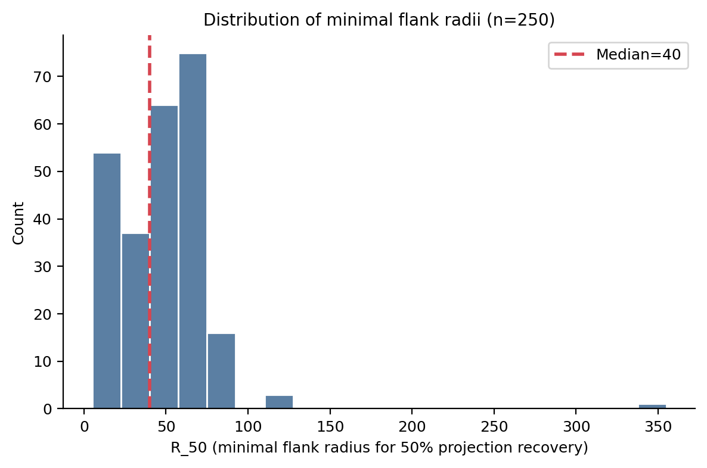

## Anchor residue composition

- I: 48 (19%)
- V: 48 (19%)
- L: 39 (16%)
- G: 24 (10%)
- F: 15 (6%)
- Y: 13 (5%)
- A: 11 (4%)
- S: 9 (4%)
- D: 9 (4%)
- M: 8 (3%)

Hydrophobic anchor residues (V/I/L/F/W/M/A): 69%.

## Sequence identity of minimal flanks

Mean pairwise identity (center-aligned): 0.064.
Max: 0.545. Min: 0.000.
Mean BLOSUM62 score: -0.93.

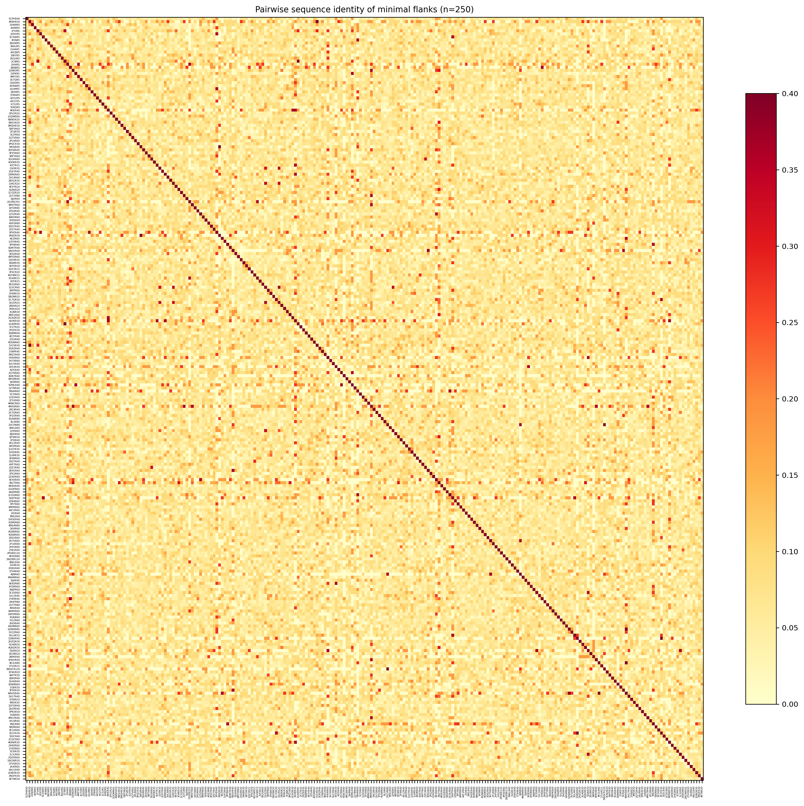

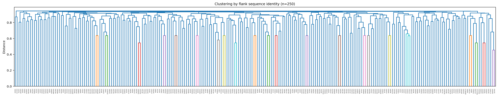

## ESM2 embedding similarity

Mean flank embedding cosine sim: 0.903.
Anchor-position embedding cosine sim: 0.195.

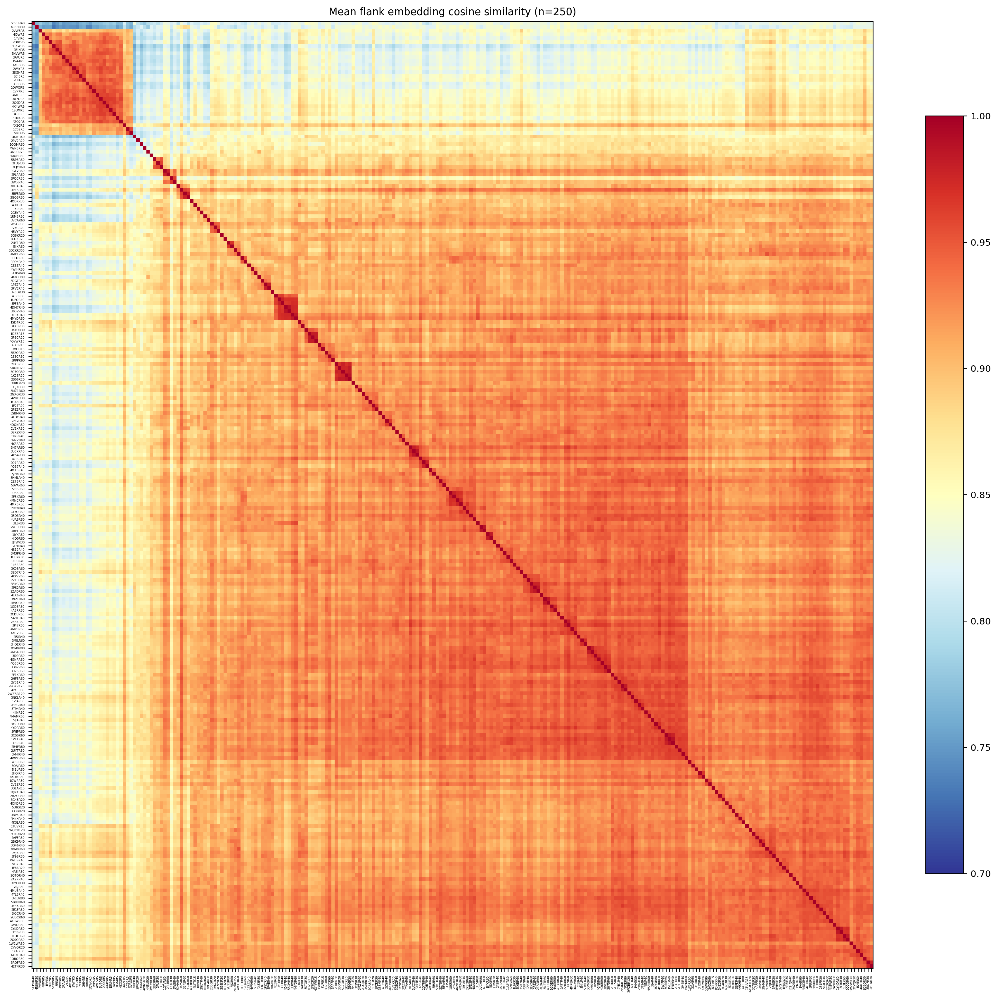

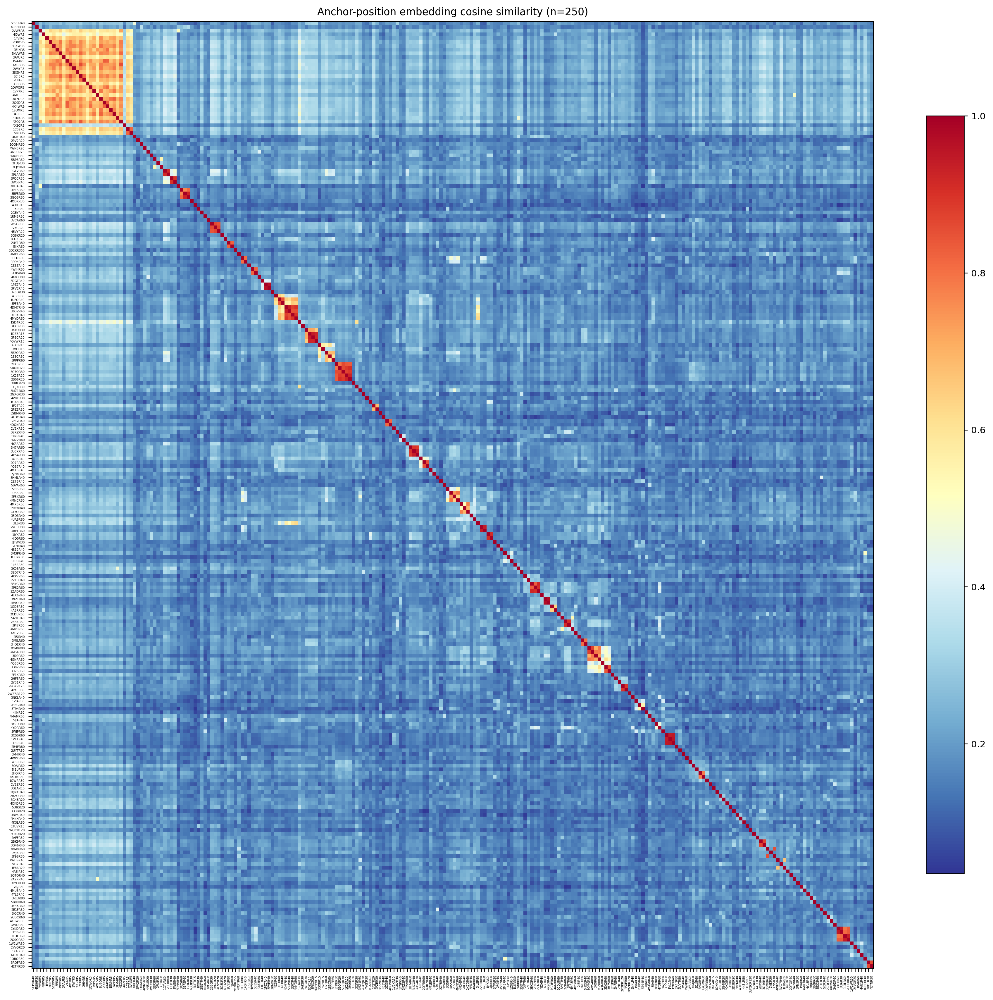

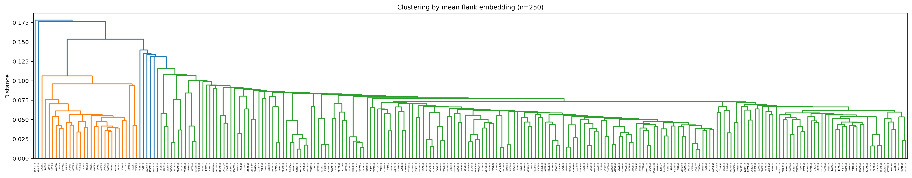

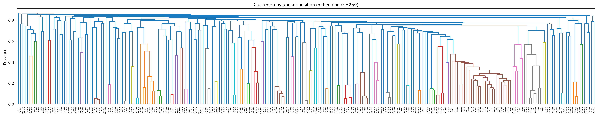

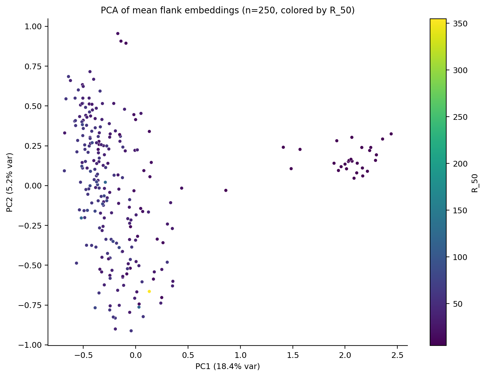

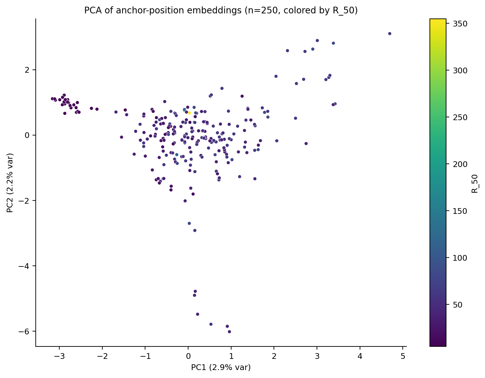

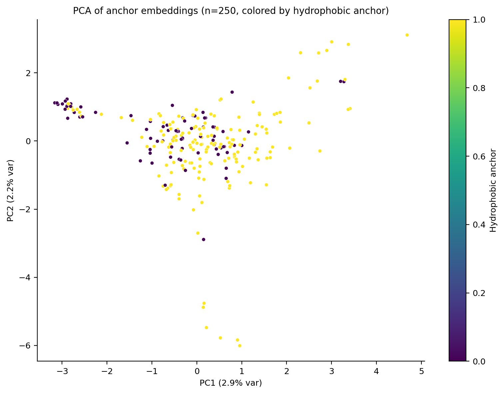

## Cross-analysis

Spearman(seq_id, mean_emb_cos): rho=-0.016 (p=5.21e-03).
Spearman(seq_id, anchor_emb_cos): rho=0.019 (p=8.78e-04).
Spearman(blosum, mean_emb_cos): rho=-0.025 (p=1.23e-05).

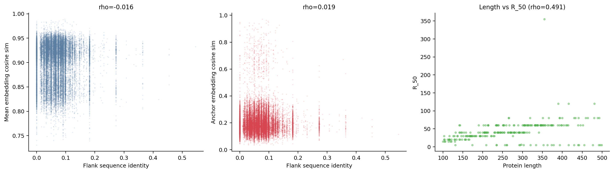

