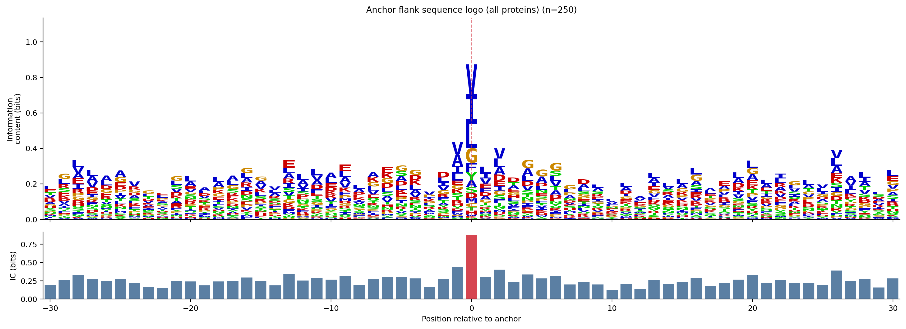
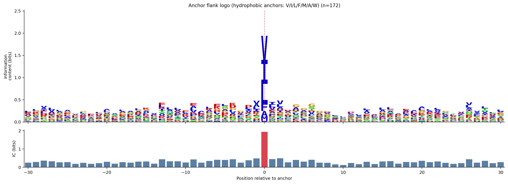
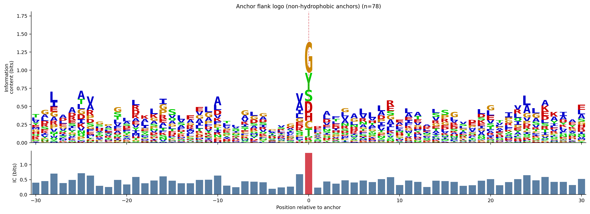
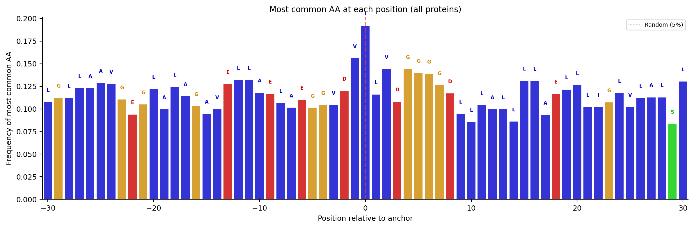
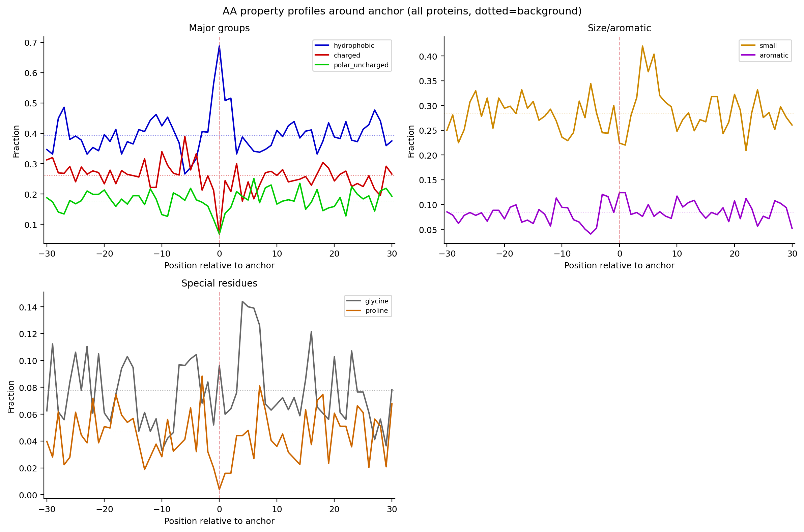
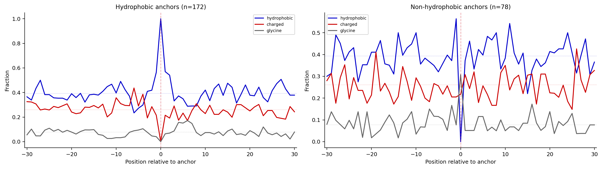
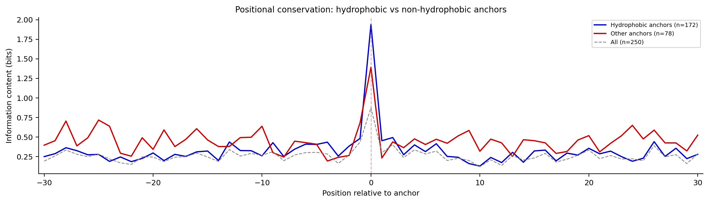

# Anchor Flank Motif Analysis

Flanks from 250 proteins (v2 clustering data), center-aligned on anchor position.
Window: +/- 30 positions around anchor.

## Information content

IC at anchor position (pos 0): 0.874 bits.
Max IC in window: 0.874 bits at offset 0.
Mean IC across window: 0.262 bits.
For reference: max possible IC = 4.32 bits (perfectly conserved); random ~ 0.05 bits.

## Anchor position composition

- I: 19.2%
- V: 19.2%
- L: 15.6%

## Positions with elevated conservation (IC > 0.2 bits)

| Offset | IC (bits) | Top AA | Frequency | n seqs |
|--------|-----------|--------|-----------|--------|
| -29 | 0.259 | G | 11.2% | 178 |
| -28 | 0.333 | L | 11.2% | 178 |
| -27 | 0.279 | L | 12.3% | 179 |
| -26 | 0.248 | A | 12.3% | 179 |
| -25 | 0.281 | A | 12.8% | 179 |
| -24 | 0.219 | V | 12.8% | 180 |
| -21 | 0.247 | G | 10.5% | 181 |
| -20 | 0.243 | L | 12.2% | 197 |
| -18 | 0.242 | L | 12.4% | 201 |
| -17 | 0.248 | A | 11.4% | 202 |
| -16 | 0.295 | G | 10.3% | 204 |
| -15 | 0.245 | A | 9.5% | 211 |
| -13 | 0.339 | E | 12.7% | 212 |
| -12 | 0.256 | L | 13.2% | 212 |
| -11 | 0.290 | L | 13.2% | 212 |
| -10 | 0.266 | A | 11.8% | 212 |
|  -9 | 0.312 | E | 11.7% | 214 |
|  -7 | 0.270 | A | 10.1% | 217 |
|  -6 | 0.300 | E | 11.0% | 218 |
|  -5 | 0.304 | G | 10.1% | 247 |
|  -4 | 0.282 | G | 10.4% | 249 |
|  -2 | 0.269 | D | 12.0% | 250 |
|  -1 | 0.437 | V | 15.6% | 250 |
|  +0 | 0.874 | I | 19.2% | 250 |
|  +1 | 0.298 | L | 11.6% | 250 |
|  +2 | 0.403 | V | 14.4% | 250 |
|  +3 | 0.237 | D | 10.8% | 250 |
|  +4 | 0.336 | G | 14.4% | 250 |
|  +5 | 0.282 | G | 14.0% | 250 |
|  +6 | 0.320 | G | 13.9% | 223 |
|  +8 | 0.228 | D | 11.7% | 222 |
| +11 | 0.209 | L | 10.4% | 221 |
| +13 | 0.263 | L | 10.0% | 221 |
| +14 | 0.206 | L | 8.6% | 221 |
| +15 | 0.232 | L | 13.1% | 221 |
| +16 | 0.291 | L | 13.1% | 214 |
| +18 | 0.216 | E | 11.7% | 214 |
| +19 | 0.266 | L | 12.1% | 214 |
| +20 | 0.333 | L | 12.6% | 214 |
| +21 | 0.224 | L | 10.2% | 196 |
| +22 | 0.263 | I | 10.2% | 196 |
| +23 | 0.218 | G | 10.7% | 196 |
| +24 | 0.221 | L | 11.7% | 196 |
| +26 | 0.389 | L | 11.2% | 196 |
| +27 | 0.246 | A | 11.3% | 195 |
| +28 | 0.274 | L | 11.3% | 195 |
| +30 | 0.282 | L | 13.0% | 192 |

## Property enrichment at anchor

| Property | At anchor | Background | Enrichment |
|----------|-----------|------------|------------|
| hydrophobic | 68.8% | 39.3% | 1.75x |
| charged | 6.8% | 26.1% | 0.26x |
| small | 22.4% | 28.4% | 0.79x |
| aromatic | 12.4% | 8.4% | 1.47x |
| glycine | 9.6% | 7.8% | 1.24x |

## Stratified analysis

Hydrophobic anchors (V/I/L/F/M/A/W): 172 proteins. IC at anchor: 1.940.
Non-hydrophobic anchors: 78 proteins. IC at anchor: 1.392.

## Figures

