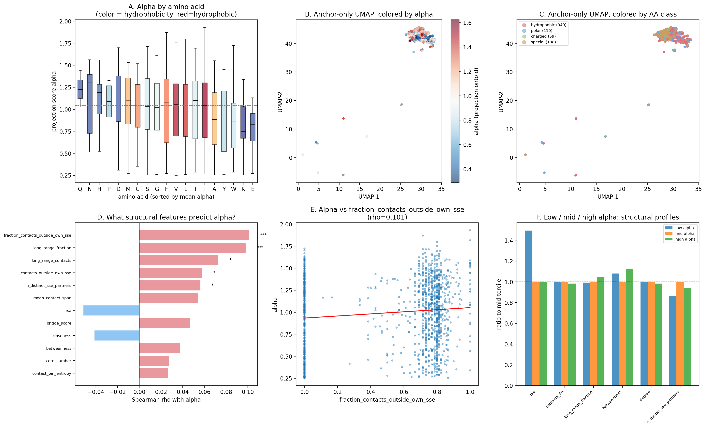

# Anchor Projection Analysis: What Determines alpha_i = x_i . d?

High-confidence subset: 500 proteins.
Anchor residues: 1256 (top-3 per protein, proj >= 0.25).
Control residues: 1500 (median-ranked by projection).

## Decomposition summary

| Metric | Anchors | Controls |
|--------|---------|----------|
| Mean alpha | 0.993 | -0.556 |
| Std alpha | 0.378 | 0.054 |
| Mean ||x|| | 8.937 | 6.210 |

## Per-amino-acid alpha

| AA | N | Mean alpha | Median alpha | Std |
|----|----|------------|-------------|-----|
| R | 2 | 1.331 | 1.331 | 0.031 |
| Q | 3 | 1.232 | 1.224 | 0.171 |
| N | 13 | 1.111 | 1.301 | 0.358 |
| H | 28 | 1.094 | 1.194 | 0.299 |
| P | 4 | 1.091 | 1.090 | 0.200 |
| D | 17 | 1.085 | 1.174 | 0.374 |
| M | 18 | 1.065 | 1.098 | 0.334 |
| C | 31 | 1.024 | 1.084 | 0.346 |
| S | 34 | 1.021 | 1.029 | 0.373 |
| G | 107 | 1.010 | 1.023 | 0.330 |
| F | 87 | 1.005 | 1.081 | 0.402 |
| V | 258 | 0.995 | 1.052 | 0.381 |
| L | 252 | 0.993 | 1.040 | 0.382 |
| T | 39 | 0.989 | 1.099 | 0.401 |
| I | 237 | 0.989 | 1.041 | 0.386 |
| A | 82 | 0.893 | 0.886 | 0.367 |
| Y | 21 | 0.887 | 0.960 | 0.379 |
| W | 11 | 0.886 | 0.859 | 0.444 |
| K | 8 | 0.885 | 0.746 | 0.456 |
| E | 4 | 0.766 | 0.831 | 0.314 |

Kruskal-Wallis test (AA -> alpha): H=14.9, p=4.55e-01.

## Structural feature correlations with alpha

N = 1225 anchors with structural data.

| Feature | Spearman rho | p-value |
|---------|-------------|----------|
| fraction_contacts_outside_own_sse | +0.101 | 3.80e-04 |
| long_range_fraction | +0.098 | 5.91e-04 |
| long_range_contacts | +0.073 | 1.06e-02 |
| contacts_outside_own_sse | +0.058 | 4.41e-02 |
| n_distinct_sse_partners | +0.056 | 4.89e-02 |
| mean_contact_span | +0.054 | 5.73e-02 |
| rsa | -0.051 | 7.22e-02 |
| bridge_score | +0.047 | 1.00e-01 |
| closeness | -0.041 | 1.49e-01 |
| betweenness | +0.037 | 1.90e-01 |
| core_number | +0.028 | 3.35e-01 |
| contact_bin_entropy | +0.026 | 3.56e-01 |
| contacts_8A | -0.024 | 3.92e-01 |
| degree | -0.024 | 3.92e-01 |
| clustering_coeff | -0.018 | 5.22e-01 |
| max_contact_span | +0.016 | 5.67e-01 |
| eigenvector | -0.015 | 5.92e-01 |
| n_contact_bins | +0.012 | 6.68e-01 |
| contacts_10A | +0.007 | 8.18e-01 |

## Alpha tercile structural profiles

| Tercile | alpha range | rsa | contacts_8A | long_range_fraction | betweenness | degree | n_distinct_sse_partners |
|---------|-------------|--------|--------|--------|--------|--------|--------|
| low | [0.25, 0.81] | 0.022 | 13.823 | 0.565 | 0.034 | 13.823 | 3.311 |
| mid | [0.81, 1.22] | 0.015 | 13.897 | 0.569 | 0.031 | 13.897 | 3.831 |
| high | [1.22, 1.93] | 0.015 | 13.652 | 0.596 | 0.035 | 13.652 | 3.601 |

## How d decomposes in anchor PCA space

|cos(PC1, d)| = 0.2294.
Most d-aligned PC: PC1 with |cos| = 0.2294.
Fraction of d captured by 30 PCs: 0.1208.

### PC-alpha correlations

| PC | rho(PC, alpha) | |cos(PC, d)| |
|----|---------------|----------------|
| PC1 | +0.689 | 0.2294 |
| PC4 | +0.262 | 0.1043 |
| PC7 | +0.252 | 0.0750 |
| PC10 | +0.240 | 0.1072 |
| PC2 | +0.205 | 0.0845 |
| PC3 | +0.144 | 0.0591 |
| PC5 | +0.076 | 0.0086 |
| PC9 | +0.046 | 0.0159 |
| PC8 | +0.025 | 0.0120 |
| PC6 | -0.014 | 0.0265 |

