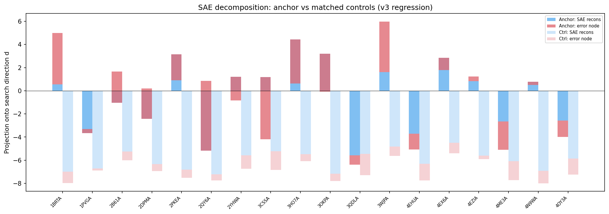
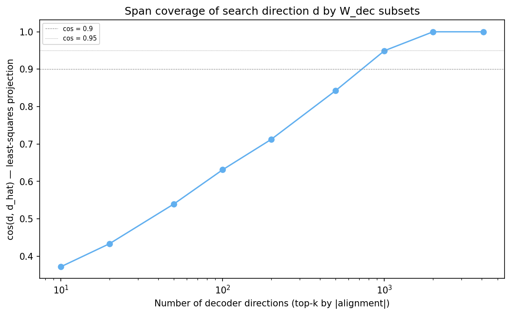
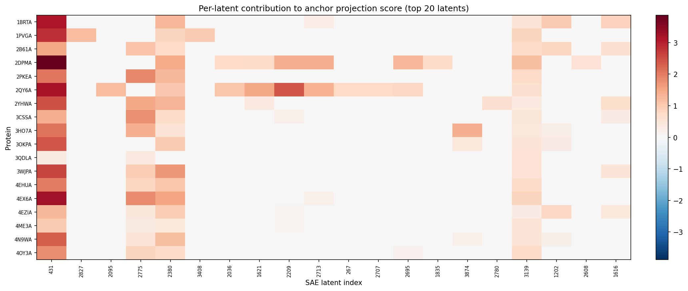
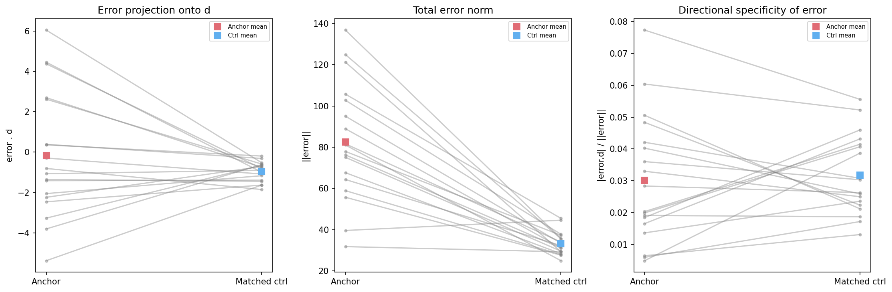

# SAE Decomposition of Anchor Projection Score (v2)

Search direction d: L10H9 key-side W_K^T @ q_mean from 2B61A.
SAE: InterProt layer 8, top-k=128, 4096 latents.

For each position, we decompose x . d = (SAE reconstruction) . d + error . d.
The SAE reconstruction further decomposes into per-latent contributions + bias + mean.
The error node is computed once from the original forward pass and frozen.

v2 changes: uses sae.LN() directly (verified against sae.forward_val()), matched controls from v3 regression (same SSE, RSA, contacts_8A), least-squares span coverage instead of greedy reconstruction, error directionality analysis.

## LN verification

Max |x_hat_manual - sae.forward_val(x)| across all proteins: 0.00e+00.

## Per-protein decomposition

Controls are matched on SSE type, RSA, and contacts_8A from anchor_regression_v3.

| Protein | Type | N ctrl | Total | Recons | Error | ||error|| | |e.d|/||e|| |
|---------|------|--------|-------|--------|-------|----------|------------|
| 1BRTA | anchor | - | 5.003 | 0.551 | 4.452 | 105.742 | 0.0421 |
| 1BRTA | ctrl_mean | 10 | -7.974 | -6.978 | -0.996 | 45.501 | 0.0308 |
| 1PVGA | anchor | - | -3.309 | -3.671 | 0.362 | 55.720 | 0.0065 |
| 1PVGA | ctrl_mean | 10 | -6.899 | -6.705 | -0.193 | 27.641 | 0.0132 |
| 2B61A | anchor | - | 1.662 | -1.035 | 2.698 | 95.047 | 0.0284 |
| 2B61A | ctrl_mean | 10 | -5.999 | -5.250 | -0.749 | 33.456 | 0.0263 |
| 2DPMA | anchor | - | 0.188 | -2.433 | 2.621 | 136.821 | 0.0192 |
| 2DPMA | ctrl_mean | 10 | -6.934 | -6.344 | -0.589 | 35.764 | 0.0187 |
| 2PKEA | anchor | - | 0.913 | 3.146 | -2.234 | 67.650 | 0.0330 |
| 2PKEA | ctrl_mean | 1 | -7.530 | -6.820 | -0.709 | 28.350 | 0.0250 |
| 2QY6A | anchor | - | 0.867 | -5.174 | 6.042 | 124.940 | 0.0484 |
| 2QY6A | ctrl_mean | 10 | -7.743 | -7.218 | -0.525 | 35.597 | 0.0224 |
| 2YHWA | anchor | - | -0.836 | 1.214 | -2.050 | 102.766 | 0.0199 |
| 2YHWA | ctrl_mean | 10 | -6.732 | -5.567 | -1.165 | 37.760 | 0.0407 |
| 3CSSA | anchor | - | -4.195 | 1.176 | -5.371 | 88.954 | 0.0604 |
| 3CSSA | ctrl_mean | 10 | -6.847 | -5.221 | -1.626 | 31.244 | 0.0522 |
| 3HO7A | anchor | - | 0.628 | 4.426 | -3.798 | 75.094 | 0.0506 |
| 3HO7A | ctrl_mean | 10 | -6.082 | -5.467 | -0.615 | 29.590 | 0.0212 |
| 3OKPA | anchor | - | -0.070 | 3.194 | -3.264 | 81.082 | 0.0403 |
| 3OKPA | ctrl_mean | 1 | -7.806 | -7.159 | -0.647 | 24.958 | 0.0259 |
| 3QDLA | anchor | - | -6.379 | -5.572 | -0.807 | 39.613 | 0.0204 |
| 3QDLA | ctrl_mean | 1 | -7.297 | -5.447 | -1.850 | 44.596 | 0.0415 |
| 3WJPA | anchor | - | 5.973 | 1.601 | 4.372 | 121.279 | 0.0360 |
| 3WJPA | ctrl_mean | 10 | -5.630 | -4.816 | -0.813 | 29.305 | 0.0303 |
| 4EHUA | anchor | - | -5.062 | -3.708 | -1.354 | 81.642 | 0.0166 |
| 4EHUA | ctrl_mean | 10 | -7.740 | -6.298 | -1.442 | 34.004 | 0.0432 |
| 4EX6A | anchor | - | 1.779 | 2.846 | -1.067 | 77.952 | 0.0137 |
| 4EX6A | ctrl_mean | 10 | -5.392 | -4.495 | -0.897 | 37.267 | 0.0236 |
| 4EZIA | anchor | - | 1.228 | 0.841 | 0.387 | 64.335 | 0.0060 |
| 4EZIA | ctrl_mean | 10 | -5.911 | -5.602 | -0.310 | 32.261 | 0.0172 |
| 4ME3A | anchor | - | -5.098 | -2.640 | -2.457 | 31.787 | 0.0773 |
| 4ME3A | ctrl_mean | 1 | -7.711 | -6.084 | -1.627 | 29.287 | 0.0556 |
| 4N9WA | anchor | - | 0.495 | 0.786 | -0.292 | 58.932 | 0.0050 |
| 4N9WA | ctrl_mean | 1 | -7.987 | -6.906 | -1.082 | 27.932 | 0.0387 |
| 4OY3A | anchor | - | -3.979 | -2.570 | -1.409 | 76.268 | 0.0185 |
| 4OY3A | ctrl_mean | 10 | -7.250 | -5.865 | -1.385 | 31.098 | 0.0460 |

## Error analysis: anchor vs matched controls

Key question: are anchors specifically hard to reconstruct along d, or are they just globally high-error points?

|error.d|/||error|| measures what fraction of the total error vector is aligned with the search direction. If anchors have higher values than matched controls, the SAE specifically misses the d component at anchors rather than being generally worse at reconstructing them.

| Metric | Anchor mean | Ctrl mean | Diff |
|--------|-------------|-----------|------|
| error . d | -0.176 | -0.957 | 0.781 |
| ||error|| | 82.535 | 33.089 | 49.445 |
| |error.d|/||error|| | 0.0301 | 0.0318 | -0.0017 |

Paired t-test on |error.d|/||error|| (anchor - ctrl): t=-0.376, p=0.7116, direction consistency=10/18.
Paired t-test on ||error|| (anchor - ctrl): t=7.538, p=0.0000.

## Top 20 latents by mean anchor contribution

| Latent | N anchor | N control | Mean anchor | Mean control | Diff |
|--------|----------|-----------|-------------|--------------|------|
| 431 | 18 | 135 | 2.1952 | 1.1518 | 1.0434 |
| 2827 | 1 | 0 | 1.1925 | 0.0000 | 1.1925 |
| 2095 | 1 | 0 | 1.1828 | 0.0000 | 1.1828 |
| 2775 | 13 | 71 | 1.0529 | 0.7498 | 0.3031 |
| 2380 | 17 | 73 | 1.0444 | 0.5502 | 0.4942 |
| 3408 | 1 | 0 | 1.0017 | 0.0000 | 1.0017 |
| 2036 | 2 | 0 | 0.9289 | 0.0000 | 0.9289 |
| 1621 | 3 | 2 | 0.8537 | 0.1655 | 0.6883 |
| 2209 | 5 | 5 | 0.8325 | 0.1597 | 0.6728 |
| 2713 | 4 | 4 | 0.7922 | 0.1340 | 0.6582 |
| 267 | 1 | 0 | 0.7793 | 0.0000 | 0.7793 |
| 2707 | 1 | 0 | 0.7634 | 0.0000 | 0.7634 |
| 2695 | 3 | 1 | 0.7497 | 0.2132 | 0.5365 |
| 1835 | 1 | 2 | 0.7177 | 0.3646 | 0.3532 |
| 3874 | 3 | 0 | 0.6689 | 0.0000 | 0.6689 |
| 2780 | 1 | 0 | 0.6653 | 0.0000 | 0.6653 |
| 3139 | 18 | 135 | 0.6186 | 0.6274 | -0.0088 |
| 1202 | 6 | 8 | 0.5770 | 0.1410 | 0.4360 |
| 2608 | 1 | 0 | 0.5673 | 0.0000 | 0.5673 |
| 1616 | 6 | 1 | 0.5620 | 0.2181 | 0.3439 |

## Top 20 latents by differential contribution (anchor - control)

| Latent | N anchor | N control | Mean anchor | Mean control | Diff |
|--------|----------|-----------|-------------|--------------|------|
| 2827 | 1 | 0 | 1.1925 | 0.0000 | 1.1925 |
| 2095 | 1 | 0 | 1.1828 | 0.0000 | 1.1828 |
| 431 | 18 | 135 | 2.1952 | 1.1518 | 1.0434 |
| 3408 | 1 | 0 | 1.0017 | 0.0000 | 1.0017 |
| 136 | 0 | 3 | 0.0000 | -0.9852 | 0.9852 |
| 2036 | 2 | 0 | 0.9289 | 0.0000 | 0.9289 |
| 267 | 1 | 0 | 0.7793 | 0.0000 | 0.7793 |
| 2707 | 1 | 0 | 0.7634 | 0.0000 | 0.7634 |
| 2553 | 0 | 2 | 0.0000 | -0.6891 | 0.6891 |
| 1621 | 3 | 2 | 0.8537 | 0.1655 | 0.6883 |
| 2209 | 5 | 5 | 0.8325 | 0.1597 | 0.6728 |
| 3874 | 3 | 0 | 0.6689 | 0.0000 | 0.6689 |
| 2780 | 1 | 0 | 0.6653 | 0.0000 | 0.6653 |
| 2713 | 4 | 4 | 0.7922 | 0.1340 | 0.6582 |
| 3763 | 0 | 4 | 0.0000 | -0.6348 | 0.6348 |
| 451 | 0 | 2 | 0.0000 | -0.6099 | 0.6099 |
| 2608 | 1 | 0 | 0.5673 | 0.0000 | 0.5673 |
| 2959 | 1 | 0 | 0.5553 | 0.0000 | 0.5553 |
| 2695 | 3 | 1 | 0.7497 | 0.2132 | 0.5365 |
| 2380 | 17 | 73 | 1.0444 | 0.5502 | 0.4942 |

## Span coverage of d by W_dec (least-squares projection)

For each subset size k, we solve min ||W_dec_sub^T @ alpha - d||^2 and report cos(d, d_hat).
This is the correct test for whether d lies in the span of the decoder directions, unlike greedy reconstruction which is confounded by non-orthogonality of the overcomplete dictionary.

Full W_dec (4096 directions): cos = 1.000000, residual = 0.000000

| k (top by |align|) | cos(d, d_hat) | residual |
|---------------------|---------------|----------|
| 10 | 0.3720 | 0.9282 |
| 20 | 0.4337 | 0.9011 |
| 50 | 0.5399 | 0.8418 |
| 100 | 0.6312 | 0.7756 |
| 200 | 0.7126 | 0.7016 |
| 500 | 0.8429 | 0.5381 |
| 1000 | 0.9494 | 0.3142 |
| 2000 | 1.0000 | 0.0000 |
| 4096 | 1.0000 | 0.0000 |

