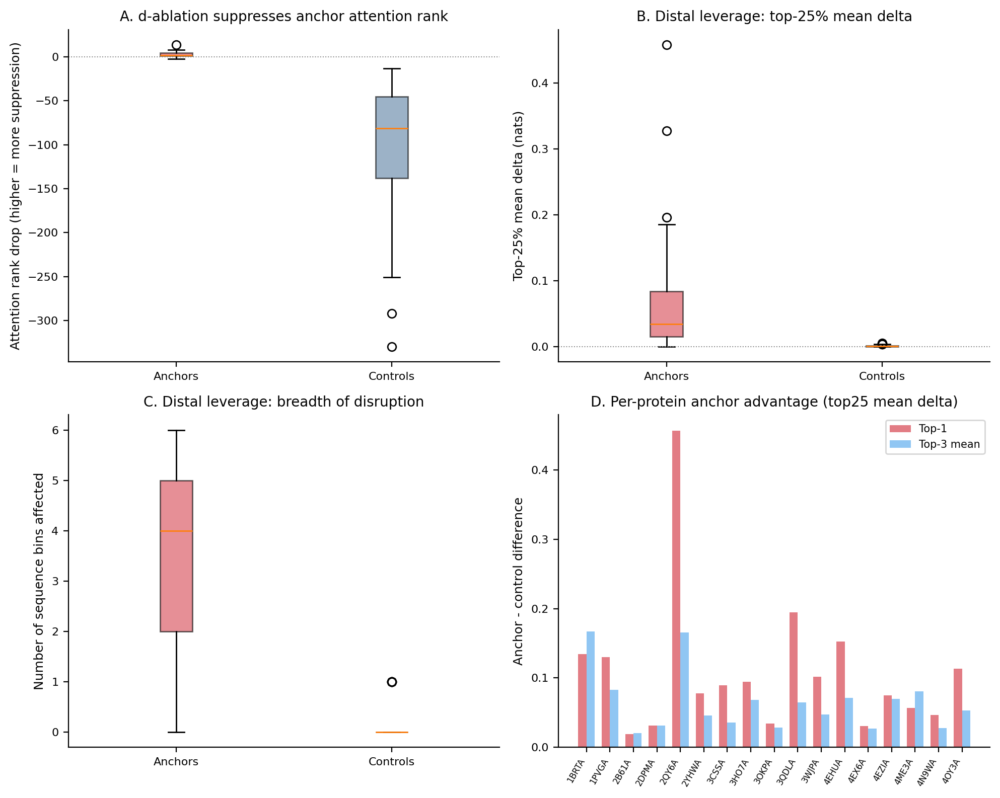

# Selector-Direction Ablation for Anchor Residues

Proteins analyzed: 17.
Ablation strength: c = 1.0.
Anchors: top-3 by projection score. Controls: 5 matched on SSE/RSA/contacts_8A.
Distant targets: 16 per source, |i-j| >= 24.

## Analysis 1: Selector validation

Mean rank drop: anchors = 2.9, controls = -97.1.
Anchors losing top-3 status: 26/51 (51%).
Mean mass ratio (ablated/clean): anchors = 0.201, controls = 7.422.

## Analysis 2: Distal leverage

| Metric | Anchors (mean) | Controls (mean) | Diff | t-test p | Wilcoxon p |
|--------|---------------|-----------------|------|----------|------------|
| Top-25% mean delta | 0.0656 | 0.0016 | 0.0639 | 0.0005 | 0.0000 |
| Bins affected | 3.3529 | 0.0824 | 3.2706 | 0.0000 | 0.0003 |
| Fraction positive | 0.5000 | 0.4904 | 0.0096 | 0.6670 | 0.5693 |
| Affected bin entropy | 1.0773 | 0.0000 | 1.0773 | 0.0000 | 0.0003 |
| Mean delta | 0.0029 | 0.0001 | 0.0029 | 0.3895 | 0.9632 |

## Top-1 vs Top-3 comparison

| Metric | Top-1 mean diff | Top-3 mean diff |
|--------|----------------|----------------|
| Top-25% mean delta | 0.1082 | 0.0639 |
| Bins affected | 4.2118 | 3.2706 |
| Fraction positive | 0.0132 | 0.0096 |
| Affected bin entropy | 1.3787 | 1.0773 |
| Mean delta | 0.0054 | 0.0029 |

## Per-protein results

| Protein | Top-1 rank drop | Top-1 top25 delta | Ctrl mean top25 delta | Diff |
|---------|----------------|-------------------|----------------------|------|
| 1BRTA | 3 | 0.1382 | 0.0034 | 0.1348 |
| 1PVGA | 7 | 0.1320 | 0.0020 | 0.1300 |
| 2B61A | 3 | 0.0202 | 0.0008 | 0.0194 |
| 2DPMA | 3 | 0.0327 | 0.0011 | 0.0316 |
| 2QY6A | 2 | 0.4584 | 0.0014 | 0.4570 |
| 2YHWA | 4 | 0.0792 | 0.0016 | 0.0776 |
| 3CSSA | 2 | 0.0899 | 0.0008 | 0.0891 |
| 3HO7A | 4 | 0.0970 | 0.0027 | 0.0943 |
| 3OKPA | 6 | 0.0346 | 0.0006 | 0.0339 |
| 3QDLA | 0 | 0.1964 | 0.0018 | 0.1947 |
| 3WJPA | 1 | 0.1029 | 0.0012 | 0.1017 |
| 4EHUA | 5 | 0.1540 | 0.0012 | 0.1528 |
| 4EX6A | 3 | 0.0325 | 0.0020 | 0.0306 |
| 4EZIA | 1 | 0.0766 | 0.0016 | 0.0749 |
| 4ME3A | 1 | 0.0589 | 0.0020 | 0.0569 |
| 4N9WA | 8 | 0.0487 | 0.0020 | 0.0467 |
| 4OY3A | 2 | 0.1148 | 0.0016 | 0.1132 |

