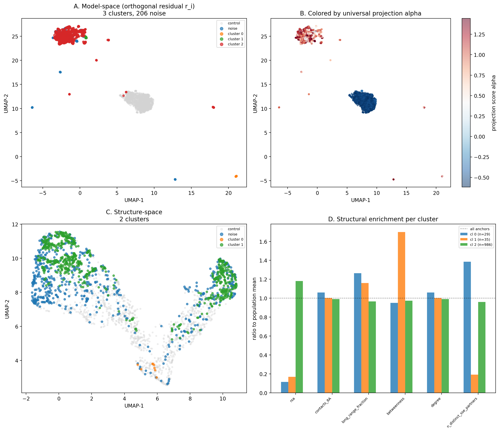

# Anchor Subtype Discovery

High-confidence subset: 500 proteins (rho >= 0.95, top-3 mass >= 0.7).
Anchor residues: 1256 (top-3 per protein, proj >= 0.25).
Control residues: 1500 (median-ranked by projection).
Search direction d from 2B61A.

## Decomposition: x_i = alpha_i * d + r_i

| Metric | Anchors | Controls |
|--------|---------|----------|
| Mean alpha | 0.993 | -0.556 |
| Std alpha | 0.378 | 0.054 |
| Mean ||r|| | 8.876 | 6.185 |

## A. Model-space clustering (PCA -> UMAP -> HDBSCAN on r_i)

PCA: 30 components, cumulative variance explained: 0.288.
Top-5 PC variance ratios: [0.047600001096725464, 0.015200000256299973, 0.012400000356137753, 0.011800000444054604, 0.011300000362098217].

HDBSCAN found 3 clusters with 206 noise points (7.5%).

### Cluster summary

| Cluster | N anchors | Mean alpha | Top AAs |
|---------|-----------|------------|---------|
| 0 | 29 | 0.918 | L(16), V(5), A(3), I(3), Y(2) |
| 1 | 35 | 1.140 | V(9), F(9), L(7), I(5), T(2) |
| 2 | 986 | 0.929 | V(185), L(185), I(172), G(106), F(68) |

### Structural enrichment per cluster

| Cluster | rsa | contacts_8A | long_range_fraction | betweenness | degree | n_distinct_sse_partners |
|---------|--------|--------|--------|--------|--------|--------|
| 0 | 0.002 | 14.621 | 0.730 | 0.032 | 14.621 | 4.966 |
| 1 | 0.003 | 13.829 | 0.670 | 0.056 | 13.829 | 0.686 |
| 2 | 0.020 | 13.660 | 0.557 | 0.032 | 13.660 | 3.439 |

## B. Structure-space clustering

Features: 19 structural descriptors.
HDBSCAN found 2 clusters with 1619 noise points.

## Model vs structure comparison

Adjusted Rand Index: -0.0255.
Normalized Mutual Information: 0.0069.

Model-space and structure-space clusters show low agreement, suggesting the orthogonal variation captured by the model is not simply recapitulating structural similarity.

