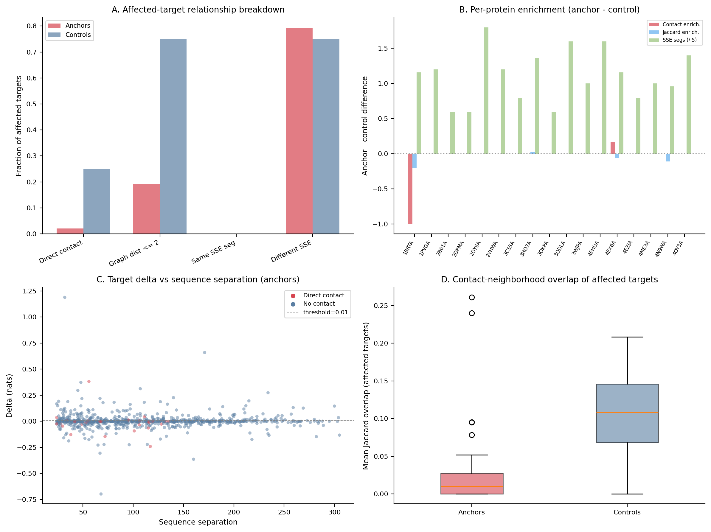

# Affected-Target Characterization after Selector Ablation

Proteins analyzed: 17. Source residues: 136. Target-level observations: 2176.
Ablation: c = 1.0. Min seq sep: 24. Contact cutoff: 8.0 A. Affected threshold: delta > 0.01. Top-k affected: 4.

## Analysis 1: What kinds of targets are affected?

| Metric | Anchor affected | Anchor all | Control affected | Control all |
|--------|----------------|-----------|-----------------|------------|
| Frac direct contact | 0.0203 | 0.0354 | 0.2500 | 0.0275 |
| Frac graph dist = 2 | 0.1726 | 0.1404 | 0.5000 | 0.1039 |
| Frac graph dist >= 3 | 0.8071 | 0.8241 | 0.2500 | 0.8686 |
| Mean graph distance | 3.9746 | 4.0381 | 2.7500 | 4.4201 |
| Frac same SSE segment | 0.0000 | 0.0000 | 0.0000 | 0.0000 |
| Frac different SSE | 0.7933 | 0.7672 | 0.7500 | 0.7500 |
| Mean Jaccard overlap | 0.0192 | 0.0194 | 0.1061 | 0.0158 |
| Mean shared contacts | 0.4519 | 0.4522 | 2.5000 | 0.3507 |

Anchor affected targets: n = 208. Control affected targets: n = 4.

## Analysis 2: Contact / graph enrichment over random distant targets

| Metric | Anchor enrichment (mean) | Control enrichment (mean) |
|--------|-------------------------|-------------------------|
| Direct contact | -0.0122 | 0.2100 |
| Graph dist <= 2 | 0.0159 | 0.5838 |
| Same SSE segment | 0.0000 | 0.0000 |
| Jaccard overlap | -0.0005 | 0.0844 |

## Analysis 3: Anchor vs control target-profile comparison

| Protein | Top-1 contact frac | Ctrl contact frac | Diff | Top-1 Jaccard | Ctrl Jaccard | Diff | Top-1 SSE segs | Ctrl SSE segs | Diff |
|---------|-------------------|-------------------|------|--------------|-------------|------|---------------|--------------|------|
| 1BRTA | 0.0000 | 1.0000 | -1.0000 | 0.0052 | 0.2083 | -0.2031 | 6.0000 | 0.2000 | 5.8000 |
| 1PVGA | 0.0000 | n/a | n/a | 0.0000 | n/a | n/a | 6.0000 | 0.0000 | 6.0000 |
| 2B61A | 0.0000 | n/a | n/a | 0.0784 | n/a | n/a | 3.0000 | 0.0000 | 3.0000 |
| 2DPMA | 0.0000 | n/a | n/a | 0.0000 | n/a | n/a | 3.0000 | 0.0000 | 3.0000 |
| 2QY6A | 0.0000 | n/a | n/a | 0.0210 | n/a | n/a | 9.0000 | 0.0000 | 9.0000 |
| 2YHWA | 0.0000 | n/a | n/a | 0.0185 | n/a | n/a | 6.0000 | 0.0000 | 6.0000 |
| 3CSSA | 0.0000 | n/a | n/a | 0.0000 | n/a | n/a | 4.0000 | 0.0000 | 4.0000 |
| 3HO7A | 0.0000 | 0.0000 | 0.0000 | 0.0214 | 0.0000 | 0.0214 | 7.0000 | 0.2000 | 6.8000 |
| 3OKPA | 0.0000 | n/a | n/a | 0.0000 | n/a | n/a | 3.0000 | 0.0000 | 3.0000 |
| 3QDLA | 0.1667 | n/a | n/a | 0.0327 | n/a | n/a | 8.0000 | 0.0000 | 8.0000 |
| 3WJPA | 0.0000 | n/a | n/a | 0.0000 | n/a | n/a | 5.0000 | 0.0000 | 5.0000 |
| 4EHUA | 0.0000 | n/a | n/a | 0.0420 | n/a | n/a | 8.0000 | 0.0000 | 8.0000 |
| 4EX6A | 0.1667 | 0.0000 | 0.1667 | 0.0302 | 0.0909 | -0.0607 | 6.0000 | 0.2000 | 5.8000 |
| 4EZIA | 0.0000 | n/a | n/a | 0.0000 | n/a | n/a | 4.0000 | 0.0000 | 4.0000 |
| 4ME3A | 0.0000 | n/a | n/a | 0.0000 | n/a | n/a | 5.0000 | 0.0000 | 5.0000 |
| 4N9WA | 0.0000 | 0.0000 | 0.0000 | 0.0146 | 0.1250 | -0.1104 | 5.0000 | 0.2000 | 4.8000 |
| 4OY3A | 0.0000 | n/a | n/a | 0.0040 | n/a | n/a | 7.0000 | 0.0000 | 7.0000 |

## Analysis 4: Top-1 vs Top-3 anchors

| Metric | Top-1 | Top-3 mean |
|--------|-------|------------|
| Mean delta | 0.0055 | 0.0029 |
| Affected frac contact | 0.0196 | 0.0326 |
| Affected mean Jaccard | 0.0158 | 0.0270 |
| Distinct SSE segments affected | 5.5882 | 4.0196 |

## Analysis 5: EVcoupling enrichment

Target pairs with EVcoupling data: 451.
Affected targets: n = 49, mean EV score = -1.0843.
Non-affected targets: n = 402, mean EV score = -1.8813.
Mann-Whitney U test (affected > not affected): p = 0.0012.

