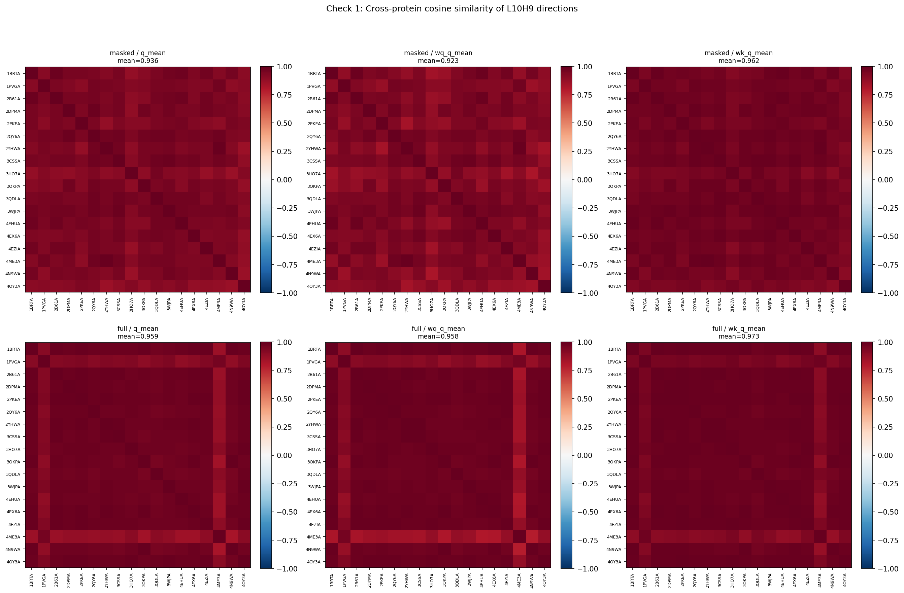
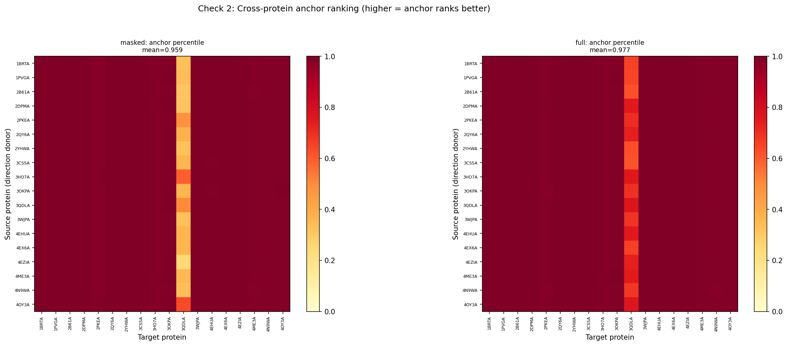
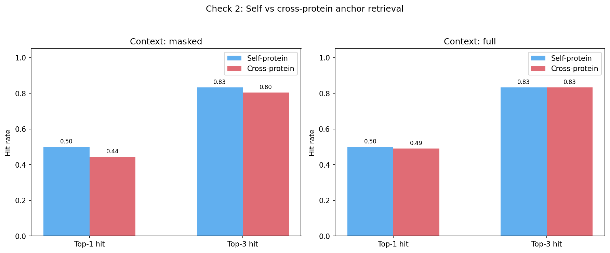

# L10H9 Universality Audit

Two checks: (1) are the query-side and key-side directions universal across proteins? (2) does a search direction from one protein generalize to rank anchors in others?

## Check 1: Cross-protein cosine similarity

For each protein, we compute the per-protein mean query direction (q_mean), the query-side projection back to residual stream (W_Q^T @ q_mean), and the key-side search direction (W_K^T @ q_mean) under both masked-task and full-sequence contexts.

| Context | Direction | Mean cos | Std | Min | Max |
|---------|-----------|----------|-----|-----|-----|
| masked | q_mean | 0.9364 | 0.0275 | 0.8589 | 0.9846 |
| masked | wq_q_mean | 0.9227 | 0.0367 | 0.8155 | 0.9845 |
| masked | wk_q_mean | 0.9620 | 0.0191 | 0.9021 | 0.9932 |
| full | q_mean | 0.9593 | 0.0370 | 0.8257 | 0.9974 |
| full | wq_q_mean | 0.9581 | 0.0483 | 0.7827 | 0.9977 |
| full | wk_q_mean | 0.9733 | 0.0265 | 0.8721 | 0.9981 |

## Check 2: Cross-protein search direction generalization

For each (source, target) protein pair, we use the source protein's W_K^T @ q_mean direction to rank residues in the target protein and check whether the known anchor is retrieved.

### Context: masked

Self-protein: mean anchor rank = 7.6, top-1 hit = 0.500, top-3 hit = 0.833

Cross-protein: mean anchor rank = 9.1, top-1 hit = 0.444, top-3 hit = 0.804

### Context: full

Self-protein: mean anchor rank = 4.6, top-1 hit = 0.500, top-3 hit = 0.833

Cross-protein: mean anchor rank = 5.4, top-1 hit = 0.490, top-3 hit = 0.833

### Leave-one-out per-target summary (masked context)

| Target | Self rank | LOO mean rank | LOO top-1 | LOO top-k |
|--------|-----------|---------------|-----------|----------|
| 1BRTA | 1 | 1.1 | 0.882 | 1.000 |
| 1PVGA | 1 | 1.0 | 1.000 | 1.000 |
| 2B61A | 1 | 1.1 | 0.941 | 1.000 |
| 2DPMA | 2 | 2.0 | 0.000 | 1.000 |
| 2PKEA | 4 | 3.8 | 0.000 | 0.118 |
| 2QY6A | 1 | 1.0 | 1.000 | 1.000 |
| 2YHWA | 1 | 1.3 | 0.706 | 1.000 |
| 3CSSA | 2 | 2.0 | 0.000 | 1.000 |
| 3HO7A | 3 | 3.0 | 0.000 | 1.000 |
| 3OKPA | 3 | 3.5 | 0.000 | 0.529 |
| 3QDLA | 104 | 130.5 | 0.000 | 0.000 |
| 3WJPA | 1 | 1.0 | 1.000 | 1.000 |
| 4EHUA | 1 | 1.6 | 0.471 | 1.000 |
| 4EX6A | 1 | 1.0 | 1.000 | 1.000 |
| 4EZIA | 1 | 1.1 | 0.941 | 1.000 |
| 4ME3A | 3 | 3.3 | 0.000 | 0.824 |
| 4N9WA | 4 | 4.4 | 0.000 | 0.000 |
| 4OY3A | 2 | 1.9 | 0.059 | 1.000 |

