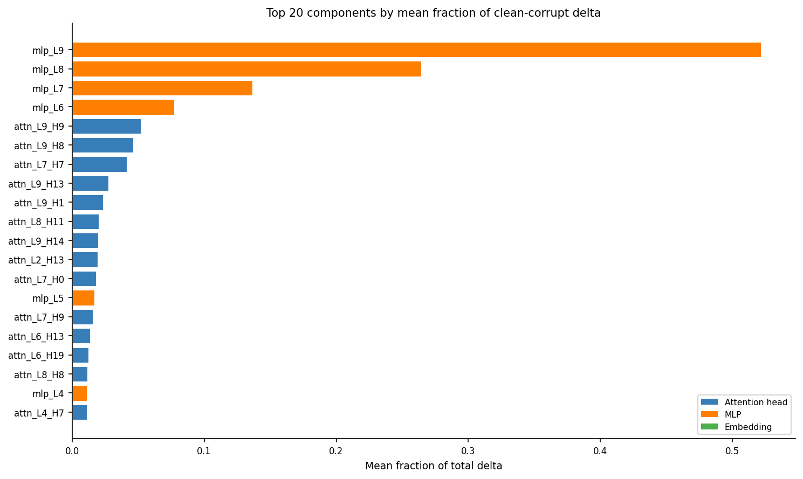
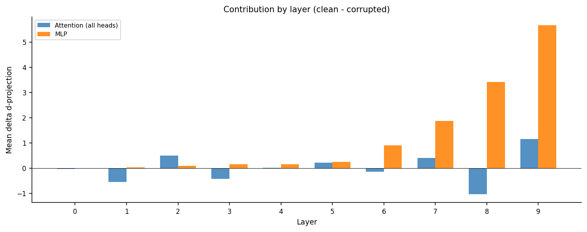
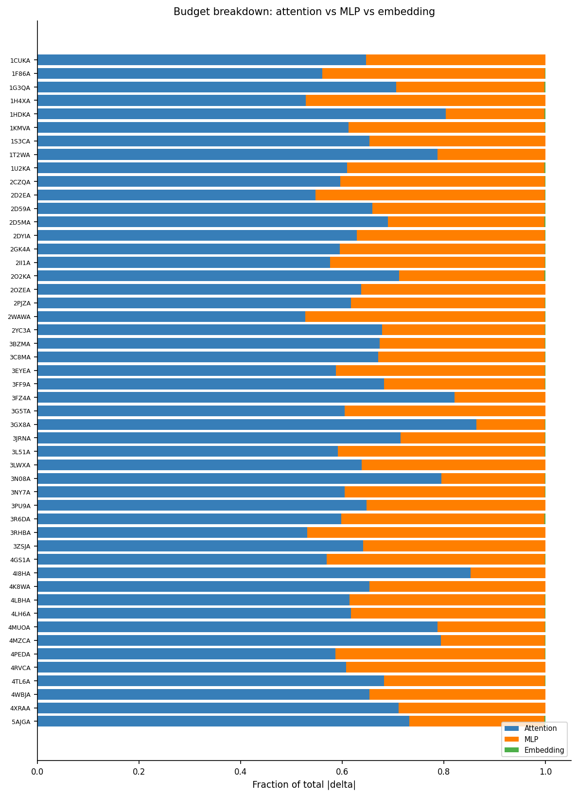
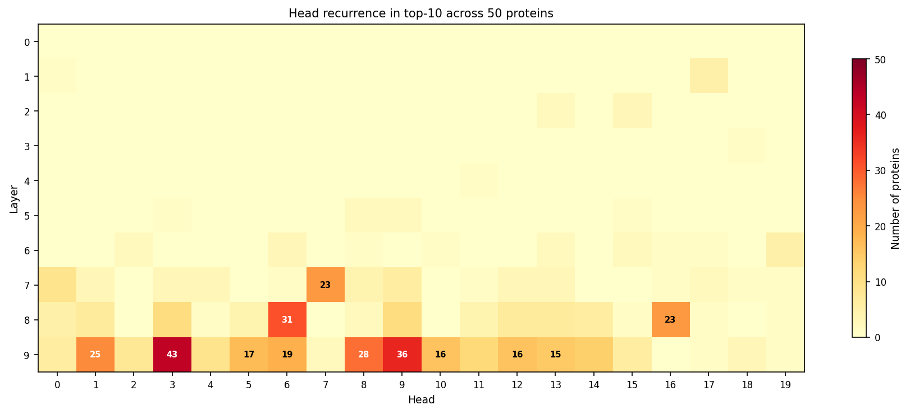
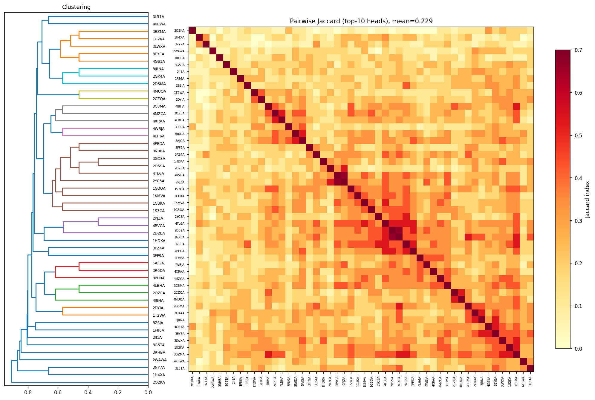
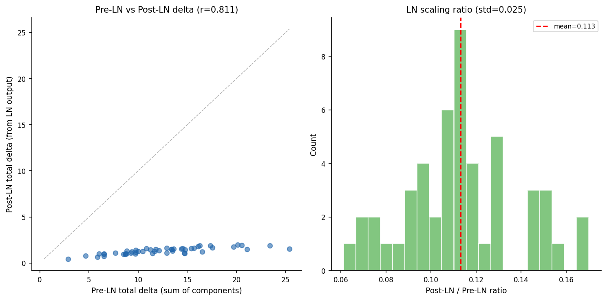

# Upstream Circuit Discovery for L10H9 Anchor Feature

Proteins analyzed: 50
Search direction d: W_K^T @ q_mean from 2B61A
Components: 1 embedding + 200 attention heads (10 layers x 20 heads) + 10 MLPs = 211
Per-head decomposition: the attention output W_O @ context is split by W_O[:, h_slice] @ context[:, h_slice]. The bias of the output projection cancels in clean-minus-corrupted deltas.

## Protein counterfactual pairs

| Protein | Anchor pos | Clean R | Corrupt R | Clean alpha_norm | Corrupt alpha_norm | Total delta |
|---------|-----------|---------|-----------|-----------------|-------------------|-------------|
| 2II1A | 166 | 60 | 40 | 0.948 | 0.150 | 13.4819 |
| 3RHBA | 22 | 15 | 12 | 0.773 | -0.158 | 13.4217 |
| 4MZCA | 22 | 15 | 12 | 0.522 | -0.089 | 8.5120 |
| 1H4XA | 46 | 30 | 20 | 0.964 | -0.145 | 23.4152 |
| 2GK4A | 87 | 40 | 30 | 0.588 | -0.127 | 8.8374 |
| 4GS1A | 341 | 120 | 80 | 0.795 | -0.073 | 7.6858 |
| 1F86A | 61 | 20 | 15 | 0.805 | -0.063 | 11.7946 |
| 1U2KA | 187 | 60 | 40 | 0.978 | -0.109 | 14.5488 |
| 3BZMA | 385 | 80 | 60 | 0.725 | 0.376 | 2.8619 |
| 3N08A | 111 | 20 | 15 | 0.761 | 0.001 | 9.7606 |
| 2O2KA | 306 | 355 | 120 | 1.000 | 0.007 | 6.0466 |
| 2D59A | 80 | 20 | 15 | 0.501 | -0.158 | 9.2765 |
| 1T2WA | 93 | 30 | 20 | 0.551 | 0.059 | 4.6575 |
| 3R6DA | 151 | 30 | 20 | 0.740 | -0.169 | 13.6335 |
| 4LH6A | 127 | 60 | 40 | 0.958 | -0.266 | 16.2534 |
| 2D5MA | 119 | 30 | 20 | 0.869 | -0.114 | 12.1105 |
| 3G5TA | 116 | 60 | 40 | 0.927 | -0.209 | 20.1502 |
| 2DYIA | 108 | 30 | 20 | 0.808 | -0.377 | 10.0209 |
| 1KMVA | 111 | 30 | 20 | 0.960 | -0.018 | 17.5689 |
| 4PEDA | 89 | 60 | 40 | 1.016 | 0.111 | 25.3868 |
| 3FF9A | 29 | 20 | 15 | 0.895 | 0.471 | 5.8501 |
| 3ZSJA | 87 | 30 | 20 | 0.958 | 0.215 | 12.9057 |
| 2D2EA | 166 | 40 | 30 | 0.849 | -0.220 | 16.1227 |
| 3C8MA | 89 | 60 | 40 | 1.023 | 0.022 | 19.7026 |
| 3EYEA | 8 | 60 | 40 | 0.971 | -0.188 | 14.4238 |
| 2YC3A | 102 | 30 | 20 | 0.720 | -0.074 | 10.4577 |
| 2OZEA | 158 | 40 | 30 | 0.601 | -0.184 | 9.7590 |
| 4K8WA | 42 | 30 | 20 | 0.930 | 0.181 | 8.8021 |
| 3LWXA | 101 | 40 | 30 | 0.729 | -0.026 | 6.5250 |
| 1G3QA | 115 | 30 | 20 | 0.834 | -0.156 | 15.4154 |
| 3NY7A | 50 | 30 | 20 | 0.833 | -0.183 | 10.8473 |
| 1S3CA | 5 | 60 | 40 | 1.043 | 0.444 | 6.5378 |
| 2CZQA | 80 | 40 | 30 | 1.043 | 0.348 | 14.6779 |
| 3JRNA | 66 | 30 | 20 | 0.730 | 0.015 | 16.5064 |
| 4TL6A | 142 | 60 | 40 | 0.950 | 0.347 | 14.7321 |
| 4RVCA | 157 | 30 | 20 | 0.711 | 0.015 | 11.6696 |
| 3FZ4A | 6 | 30 | 20 | 0.706 | -0.021 | 8.6673 |
| 4LBHA | 63 | 12 | 10 | 0.793 | 0.186 | 8.7311 |
| 3GX8A | 19 | 15 | 12 | 0.653 | 0.002 | 9.7379 |
| 4I8HA | 119 | 30 | 20 | 0.638 | -0.134 | 6.5101 |
| 2PJZA | 151 | 40 | 30 | 0.799 | -0.131 | 13.3971 |
| 5AJGA | 174 | 60 | 40 | 0.710 | -0.183 | 15.6739 |
| 2WAWA | 100 | 40 | 30 | 0.883 | -0.289 | 17.3677 |
| 4MUOA | 83 | 60 | 40 | 0.867 | -0.193 | 20.5625 |
| 3L51A | 46 | 30 | 20 | 0.807 | -0.168 | 9.3430 |
| 1HDKA | 89 | 20 | 15 | 0.879 | -0.148 | 11.2420 |
| 4WBJA | 34 | 30 | 20 | 0.909 | 0.249 | 11.4589 |
| 1CUKA | 81 | 30 | 20 | 0.849 | -0.203 | 12.8965 |
| 3PU9A | 50 | 60 | 40 | 0.859 | 0.014 | 14.7792 |
| 4XRAA | 34 | 30 | 20 | 0.749 | -0.166 | 21.0722 |

## Analysis 1: Component ranking (top 20)

| Rank | Component | Mean frac | Median frac | Mean |delta| | Sign consistency | Recurrence top-10 | Recurrence top-20 |
|------|-----------|-----------|-------------|-------------|-----------------|-------------------|-------------------|
| 1 | mlp_L9 | 0.5213 | 0.5427 | 6.7071 | 0.88 | 0.00 | 0.00 |
| 2 | mlp_L8 | 0.2643 | 0.2354 | 3.6964 | 0.88 | 0.00 | 0.00 |
| 3 | mlp_L7 | 0.1363 | 0.1126 | 2.3026 | 0.82 | 0.00 | 0.00 |
| 4 | mlp_L6 | 0.0771 | 0.0721 | 1.2554 | 0.76 | 0.00 | 0.00 |
| 5 | attn_L9_H9 | 0.0518 | 0.0046 | 1.8000 | 0.52 | 0.72 | 0.84 |
| 6 | attn_L9_H8 | 0.0462 | 0.0377 | 0.5247 | 0.88 | 0.56 | 0.70 |
| 7 | attn_L7_H7 | 0.0413 | 0.0120 | 0.7590 | 0.58 | 0.46 | 0.58 |
| 8 | attn_L9_H13 | 0.0274 | 0.0227 | 0.3248 | 0.86 | 0.30 | 0.56 |
| 9 | attn_L9_H1 | 0.0236 | -0.0099 | 0.8424 | 0.46 | 0.50 | 0.68 |
| 10 | attn_L8_H11 | 0.0200 | 0.0195 | 0.2660 | 0.86 | 0.08 | 0.46 |
| 11 | attn_L9_H14 | 0.0199 | 0.0167 | 0.3063 | 0.78 | 0.28 | 0.50 |
| 12 | attn_L2_H13 | 0.0193 | 0.0135 | 0.2033 | 1.00 | 0.04 | 0.16 |
| 13 | attn_L7_H0 | 0.0181 | 0.0077 | 0.3971 | 0.66 | 0.18 | 0.34 |
| 14 | mlp_L5 | 0.0169 | 0.0237 | 0.5952 | 0.68 | 0.00 | 0.00 |
| 15 | attn_L7_H9 | 0.0156 | 0.0131 | 0.3085 | 0.70 | 0.12 | 0.32 |
| 16 | attn_L6_H13 | 0.0136 | 0.0104 | 0.1600 | 0.90 | 0.04 | 0.12 |
| 17 | attn_L6_H19 | 0.0124 | 0.0091 | 0.2080 | 0.82 | 0.10 | 0.10 |
| 18 | attn_L8_H8 | 0.0115 | 0.0130 | 0.1891 | 0.78 | 0.04 | 0.20 |
| 19 | mlp_L4 | 0.0113 | 0.0089 | 0.2737 | 0.62 | 0.00 | 0.00 |
| 20 | attn_L4_H7 | 0.0113 | 0.0087 | 0.1200 | 1.00 | 0.00 | 0.00 |

### Top 10 attention heads

| Rank | Head | Mean frac | Sign consistency |
|------|------|-----------|------------------|
| 1 | attn_L9_H9 | 0.0518 | 0.52 |
| 2 | attn_L9_H8 | 0.0462 | 0.88 |
| 3 | attn_L7_H7 | 0.0413 | 0.58 |
| 4 | attn_L9_H13 | 0.0274 | 0.86 |
| 5 | attn_L9_H1 | 0.0236 | 0.46 |
| 6 | attn_L8_H11 | 0.0200 | 0.86 |
| 7 | attn_L9_H14 | 0.0199 | 0.78 |
| 8 | attn_L2_H13 | 0.0193 | 1.00 |
| 9 | attn_L7_H0 | 0.0181 | 0.66 |
| 10 | attn_L7_H9 | 0.0156 | 0.70 |

### Top 5 MLPs

| Rank | MLP | Mean frac | Sign consistency |
|------|-----|-----------|------------------|
| 1 | mlp_L9 | 0.5213 | 0.88 |
| 2 | mlp_L8 | 0.2643 | 0.88 |
| 3 | mlp_L7 | 0.1363 | 0.82 |
| 4 | mlp_L6 | 0.0771 | 0.76 |
| 5 | mlp_L5 | 0.0169 | 0.68 |

### Embedding

Mean frac: -0.0024, sign consistency: 0.28

## Analysis 2: Attention vs MLP budget

Across 50 proteins:
- Attention: mean 65.8%, median 64.4%
- MLP: mean 34.1%, median 35.6%
- Embedding: mean 0.1%, median 0.1%

## Analysis 3: Layer profile

| Layer | Mean attn delta | Mean MLP delta | Mean total |
|-------|----------------|---------------|------------|
| 0 | -0.0378 | -0.0201 | -0.0578 |
| 1 | -0.5490 | 0.0182 | -0.5309 |
| 2 | 0.4857 | 0.0888 | 0.5745 |
| 3 | -0.4260 | 0.1479 | -0.2781 |
| 4 | 0.0060 | 0.1500 | 0.1559 |
| 5 | 0.2179 | 0.2505 | 0.4683 |
| 6 | -0.1438 | 0.8932 | 0.7495 |
| 7 | 0.3938 | 1.8713 | 2.2651 |
| 8 | -1.0326 | 3.4188 | 2.3863 |
| 9 | 1.1559 | 5.6584 | 6.8142 |

## Analysis 4: Head recurrence

Mean pairwise Jaccard (top-10 heads): 0.229

### Heads appearing in top-10 of 30%+ proteins

| Head | Count | Fraction |
|------|-------|----------|
| attn_L9_H3 | 43/50 | 0.86 |
| attn_L9_H9 | 36/50 | 0.72 |
| attn_L8_H6 | 31/50 | 0.62 |
| attn_L9_H8 | 28/50 | 0.56 |
| attn_L9_H1 | 25/50 | 0.50 |
| attn_L7_H7 | 23/50 | 0.46 |
| attn_L8_H16 | 23/50 | 0.46 |
| attn_L9_H6 | 19/50 | 0.38 |
| attn_L9_H5 | 17/50 | 0.34 |
| attn_L9_H10 | 16/50 | 0.32 |
| attn_L9_H12 | 16/50 | 0.32 |
| attn_L9_H13 | 15/50 | 0.30 |

Highest single-head recurrence: 0.86
Interpretation: high recurrence — universal upstream circuit detected. Follow up with Analysis 5 (source position analysis for top recurring heads).

## Sanity check: pre-LN vs post-LN delta

Compares the pre-LN total delta (sum of per-component d-projections, which is what the linear decomposition operates on) to the post-LN total delta (LN(x_10)[anchor] dot d, which is what L10H9 actually sees). If the two are strongly correlated, LayerNorm acts as approximately uniform rescaling and per-component rankings are preserved.

Pearson correlation: 0.8114
Spearman rank correlation: 0.8331
Post-LN / Pre-LN ratio: mean=0.1131, std=0.0245

LN causes some distortion but overall ranking is approximately preserved.

## Figures

