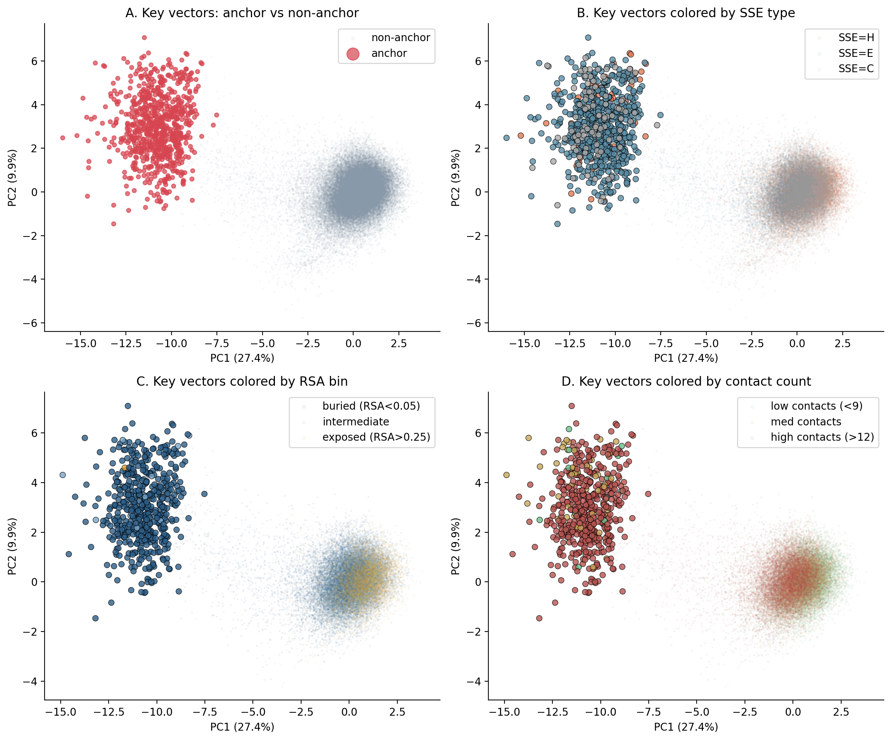
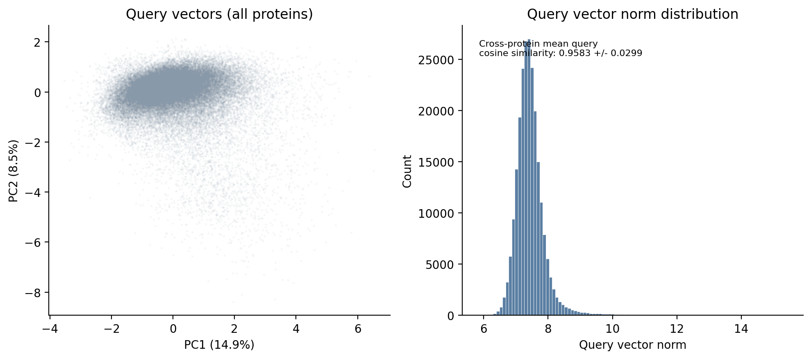
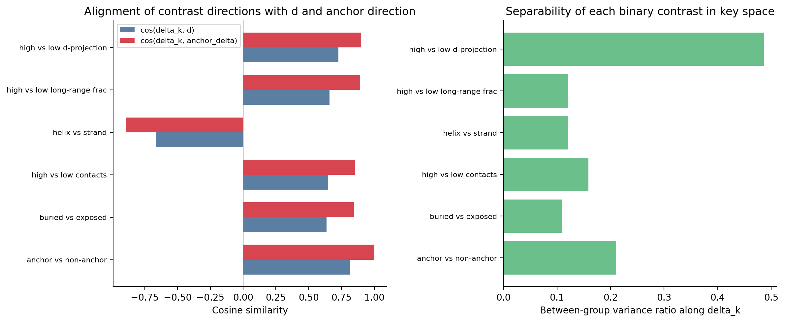
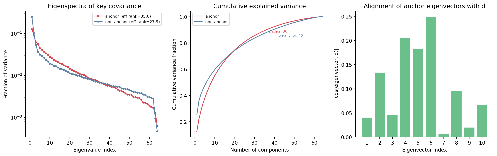

# QK Space Decomposition for L10H9

Proteins: 774 confident (top1_mass > 0.5) from 774 candidates.
Total key/query vectors: 233334 (774 anchor, 232560 non-anchor).
Proteins with PDB features: 543.

## Analysis 1: Key-space PCA

PCA on 233334 key vectors in R^64.

| PC | Variance explained | Cumulative |
|---|---|---|
| PC1 | 0.2744 | 0.2744 |
| PC2 | 0.0992 | 0.3736 |
| PC3 | 0.0505 | 0.4242 |
| PC4 | 0.0373 | 0.4614 |
| PC5 | 0.0309 | 0.4923 |
| PC6 | 0.0286 | 0.5209 |
| PC7 | 0.0259 | 0.5467 |
| PC8 | 0.0234 | 0.5701 |
| PC9 | 0.0213 | 0.5914 |
| PC10 | 0.0186 | 0.6099 |

Anchor/non-anchor between-group variance ratio (full 64D): 0.051498.
This is extremely small, meaning anchors and non-anchors are not separated by a large distance in key space relative to overall key-space spread.

Cross-protein mean query cosine similarity: 0.9583 +/- 0.0299. Queries are near-identical across proteins, confirming the rank-1 query structure.

## Analysis 2: Contrastive covariance

For each binary structural feature z1, compute delta_k = E[k|z1=1] - E[k|z1=0] and measure its alignment with the search direction d and the anchor mean direction.

| Contrast | n_pos | n_neg | ||delta_k|| | cos(delta_k, d) | cos(delta_k, anchor_delta) | var ratio |
|---|---|---|---|---|---|---|
| anchor vs non-anchor | 774 | 232560 | 11.6935 | 0.8144 | 1.0000 | 0.2104 |
| buried vs exposed | 81900 | 30801 | 1.1991 | 0.6364 | 0.8449 | 0.1098 |
| high vs low contacts | 58875 | 49605 | 1.2969 | 0.6487 | 0.8558 | 0.1586 |
| helix vs strand | 93534 | 48007 | 1.2267 | -0.6617 | -0.8954 | 0.1213 |
| high vs low long-range frac | 53025 | 49762 | 1.1564 | 0.6589 | 0.8932 | 0.1207 |
| high vs low d-projection | 77701 | 77700 | 2.5784 | 0.7267 | 0.9005 | 0.4862 |

Best structural alignment with d: helix vs strand (cos = -0.6617).

## Analysis 3: Eigenspectrum and subspace structure

Effective rank of anchor key covariance: 35.04.
Effective rank of non-anchor key covariance: 27.91.
Components for 90% variance: anchor = 36, non-anchor = 40.

Alignment of anchor eigenvectors with d:

| EV | Var fraction | |cos(ev, d)| |
|---|---|---|
| EV1 | 0.1267 | 0.0402 |
| EV2 | 0.0902 | 0.1336 |
| EV3 | 0.0616 | 0.0454 |
| EV4 | 0.0565 | 0.2046 |
| EV5 | 0.0446 | 0.1822 |
| EV6 | 0.0412 | 0.2487 |
| EV7 | 0.0371 | 0.0061 |
| EV8 | 0.0338 | 0.0957 |
| EV9 | 0.0316 | 0.0197 |
| EV10 | 0.0280 | 0.0660 |

Notable correlations between anchor eigenvector projections and structural properties (|rho| > 0.15, p < 0.01):

| Eigenvector | Property | Spearman rho | p-value |
|---|---|---|---|
| EV2 | is_strand | -0.3106 | 9.12e-19 |
| EV2 | long_range_frac | -0.2849 | 1.54e-11 |
| EV1 | long_range_frac | -0.2651 | 3.90e-10 |
| EV5 | contacts_8A | -0.2532 | 2.39e-09 |
| EV10 | contacts_8A | 0.2447 | 8.38e-09 |
| EV1 | is_strand | -0.2444 | 5.46e-12 |
| EV5 | is_strand | -0.2381 | 1.93e-11 |
| EV10 | long_range_frac | 0.2049 | 1.57e-06 |
| EV2 | is_helix | 0.1916 | 7.81e-08 |
| EV7 | contacts_8A | 0.1887 | 1.01e-05 |
| EV1 | contacts_8A | -0.1788 | 2.92e-05 |
| EV10 | is_strand | 0.1769 | 7.33e-07 |
| EV5 | is_helix | 0.1638 | 4.63e-06 |
| EV6 | is_strand | 0.1613 | 6.51e-06 |
| EV1 | is_helix | 0.1501 | 2.76e-05 |

## Interpretation

### Analysis 1: Key-space PCA

Anchor keys (red, panel A) form a single, clearly displaced cluster in the negative-PC1 region, well separated from the bulk non-anchor cloud. There are no visible subclusters among anchors -- the anchor population appears as one elongated distribution along PC1, not 2-3 discrete types. PC1 captures 27.4% of total key variance; the anchor/non-anchor between-group variance ratio is 5.1%, meaning anchors occupy a distinct but relatively narrow corner of the full key-space variation.

Panel B shows SSE type correlates with key-space position: helices (orange) and strands (blue) partially segregate, and among anchors the same SSE coloring applies (helix-anchors and strand-anchors overlap rather than forming separate anchor subtypes). Panel C reveals that anchors are overwhelmingly buried (blue, RSA < 0.05), consistent with prior classification findings. Panel D shows anchors tend toward high contact counts, though this is less clean than the burial signal.

Queries (mean cosine similarity 0.958 across proteins) are near-identical, confirming the rank-1 query structure assumed throughout.

### Analysis 2: Contrastive covariance

The anchor mean direction in key space aligns strongly with d (cos = 0.81), confirming that the search direction d captures most of what separates anchors from non-anchors in the model's own representation.

All four structural contrasts (buried/exposed, high/low contacts, helix/strand, high/low long-range fraction) produce delta_k directions with moderate alignment to d (|cos| = 0.64-0.66). These are all roughly equally aligned, and all also strongly aligned with the anchor mean direction (|cos| = 0.84-0.90). The similar cosine values across structural features reflect the fact that burial, high contact count, and high long-range fraction are all correlated structural properties of well-packed residues -- they describe essentially the same physical phenomenon (compact core packing) from different angles.

No single structural property dominates. The highest alignment with d comes from helix-vs-strand (cos = -0.66), but this is only marginally better than contacts (0.65) or long-range fraction (0.66). The structural contrasts produce much smaller delta_k norms (~1.2) compared to the anchor contrast itself (11.7), reflecting the fact that anchor/non-anchor is a much stronger separator in key space than any single structural property.

### Analysis 3: Eigenspectrum

The anchor covariance has effective rank 35 (out of 64 dimensions), meaning anchor keys are diffusely distributed rather than confined to a low-rank subspace. Non-anchor keys have similar effective rank (28). Neither population is well-described by a handful of components. 90% of anchor variance requires 36 components.

No single eigenvector of the anchor covariance aligns strongly with d. The best is EV6 with |cos| = 0.25, and most are below 0.15. This means d is not aligned with any principal variance direction of anchors -- it cuts across the main axes of anchor variation. This is consistent with d identifying a narrow feature (the anchor property) that is orthogonal to the dominant sources of within-anchor variation (which are driven by SSE, protein identity, and other factors).

The eigenvector-structural property correlations are weak but consistent: EV1 and EV2 correlate most with strand identity (rho = -0.24, -0.31) and long-range fraction (rho = -0.27, -0.28). EV5 picks up contact count (rho = -0.25). These are all below 0.35, confirming that structural properties explain only a small fraction of within-anchor key-space variation. The dominant within-anchor variation is driven by protein context (which protein the anchor comes from), not by structural type.

The Grassmann distance between anchor and non-anchor top-1 subspaces is 1.55 (maximum possible is pi/2 = 1.57), confirming that the principal variance directions of anchors and non-anchors are nearly orthogonal.

### Summary: which outcome?

This falls closest to the "informative negative" scenario from the experiment plan, with elements of the "good case":

1. Anchors DO separate from non-anchors in key-space PCA (visible in panel A), but this separation is along d (which is approximately PC1), not along anchor-specific eigenvectors. The between-group variance ratio (5.1%) is modest.

2. No single structural property aligns strongly with d. Burial, contacts, long-range fraction, and SSE all have moderate and similar alignment (cos ~ 0.64-0.66), reflecting colinear structural properties of packed core residues.

3. The anchor feature is high-dimensional (effective rank 35), not a clean low-rank subspace. d is not aligned with any dominant eigenvector of anchor covariance.

4. The strongest signal is that d detects a composite "core packing" property that combines burial, high contacts, high long-range fraction, and non-strand secondary structure. No single measurement captures it better than another because they are all facets of the same physical property.

The model has not learned a novel concept unrelated to structure -- the alignment with structural properties is real (cos ~ 0.65) -- but it has learned a composite representation that integrates multiple correlated structural signals into a single direction d, rather than encoding any one property discretely.
