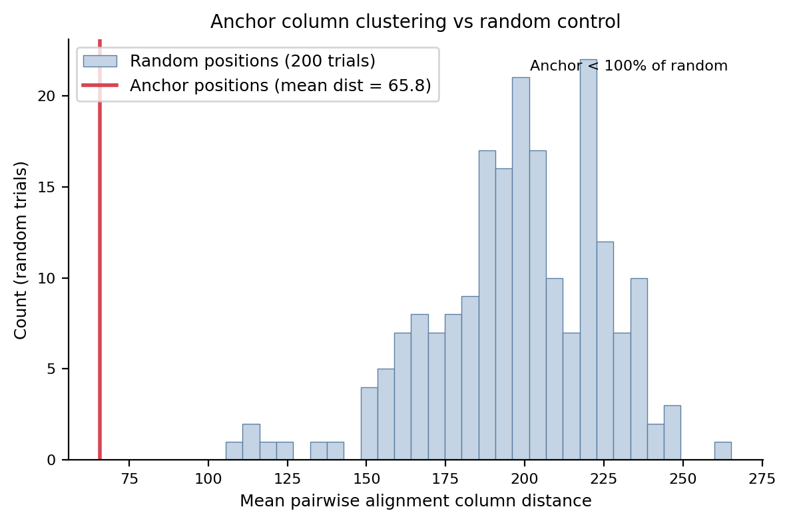
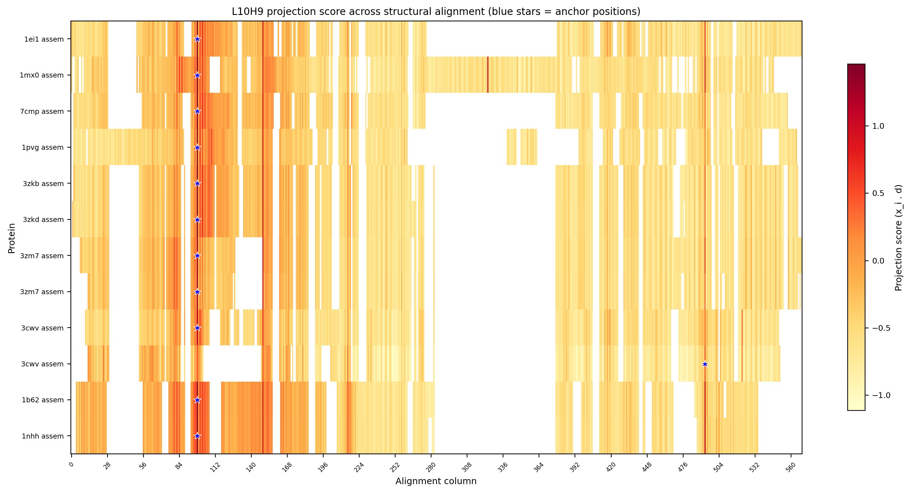
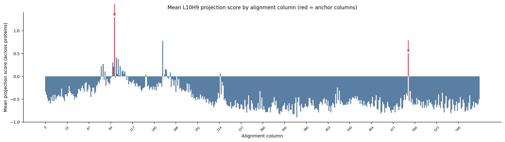

# Anchor Transfer Across Structural Homologs

## Data

Foldmason multiple structure alignment of 12 proteins (1PVGA + 11 structural hits with TM-score > 0.6, sequence identity < 25% vs 1PVGA).
Alignment length: 569 columns.

### Ungapped sequence lengths

| Protein | PDB | Ungapped length | Identity to 1PVG |
|---------|-----|-----------------|------------------|
| 1ei1-assembly1cifgz | 1ei1 | 391 | 24.6% |
| 1mx0-assembly1cifgz | 1mx0 | 455 | 16.5% |
| 7cmp-assembly2cifgz | 7cmp | 374 | 18.8% |
| 1pvg-assembly1cifgz | 1pvg | 378 | 100.0% |
| 3zkb-assembly8cifgz | 3zkb | 373 | 22.5% |
| 3zkd-assembly3cifgz | 3zkd | 376 | 22.5% |
| 3zm7-assembly1cifgz | 3zm7 | 359 | 22.4% |
| 3zm7-assembly3cifgz | 3zm7 | 346 | 22.3% |
| 3cwv-assembly1cifgz | 3cwv | 349 | 13.4% |
| 3cwv-assembly2cifgz | 3cwv | 311 | 14.9% |
| 1b62-assembly1cifgz | 1b62 | 331 | 13.8% |
| 1nhh-assembly1cifgz | 1nhh | 328 | 14.1% |

### Near-duplicate pairs (>90% identity)

- 3zkb / 3zkd: 100.0%
- 3zkb / 3zm7: 99.1%
- 3zkb / 3zm7: 99.1%
- 3zkd / 3zm7: 99.1%
- 3zkd / 3zm7: 99.1%
- 3zm7 / 3zm7: 99.4%
- 3cwv / 3cwv: 100.0%
- 1b62 / 1nhh: 99.7%

These pairs should be treated as single entries when interpreting concordance to avoid inflating agreement.

### 1PVGA anchor verification

1PVGA anchor at sequence position 101 (AA: I) maps to alignment column 109.

## Phase 2: Anchor behavior audit

Reference search direction d from 2B61A (full sequence).
Anchor-like thresholds: top1_mass > 0.15, rank_corr > 0.3.

| Protein | PDB | N res | top1_mass | rank_corr | cos(d_self, d_ref) | Anchor pos | Anchor AA | Anchor-like? |
|---------|-----|-------|-----------|-----------|--------------------|-----------:|-----------|:------------:|
| 1ei1-assembly1cifgz | 1ei1 | 391 | 0.644 | 0.984 | 0.961 | 69 | V | YES |
| 1mx0-assembly1cifgz | 1mx0 | 455 | 0.642 | 0.980 | 0.972 | 70 | V | YES |
| 7cmp-assembly2cifgz | 7cmp | 374 | 0.745 | 0.986 | 0.958 | 63 | V | YES |
| 1pvg-assembly1cifgz | 1pvg | 378 | 0.756 | 0.971 | 0.951 | 90 | V | YES |
| 3zkb-assembly8cifgz | 3zkb | 373 | 0.685 | 0.983 | 0.957 | 66 | V | YES |
| 3zkd-assembly3cifgz | 3zkd | 376 | 0.695 | 0.982 | 0.957 | 67 | V | YES |
| 3zm7-assembly1cifgz | 3zm7 | 359 | 0.548 | 0.981 | 0.954 | 61 | V | YES |
| 3zm7-assembly3cifgz | 3zm7 | 346 | 0.599 | 0.981 | 0.951 | 55 | V | YES |
| 3cwv-assembly1cifgz | 3cwv | 349 | 0.691 | 0.981 | 0.935 | 57 | L | YES |
| 3cwv-assembly2cifgz | 3cwv | 311 | 0.687 | 0.972 | 0.802 | 256 | V | YES |
| 1b62-assembly1cifgz | 1b62 | 331 | 0.601 | 0.992 | 0.972 | 57 | I | YES |
| 1nhh-assembly1cifgz | 1nhh | 328 | 0.589 | 0.992 | 0.973 | 57 | I | YES |

12/12 proteins pass the anchor-like gate.

## Phase 3: Anchor column concordance

### Anchor positions in alignment coordinates

| Protein | PDB | Anchor seq pos | Anchor aln col |
|---------|-----|---------------:|---------------:|
| 1ei1-assembly1cifgz | 1ei1 | 69 | 98 |
| 1mx0-assembly1cifgz | 1mx0 | 70 | 98 |
| 7cmp-assembly2cifgz | 7cmp | 63 | 98 |
| 1pvg-assembly1cifgz | 1pvg | 90 | 98 |
| 3zkb-assembly8cifgz | 3zkb | 66 | 98 |
| 3zkd-assembly3cifgz | 3zkd | 67 | 98 |
| 3zm7-assembly1cifgz | 3zm7 | 61 | 98 |
| 3zm7-assembly3cifgz | 3zm7 | 55 | 98 |
| 3cwv-assembly1cifgz | 3cwv | 57 | 98 |
| 3cwv-assembly2cifgz | 3cwv | 256 | 493 |
| 1b62-assembly1cifgz | 1b62 | 57 | 98 |
| 1nhh-assembly1cifgz | 1nhh | 57 | 98 |

### Pairwise anchor column distances

Mean pairwise distance: 65.8 columns.
Median: 0.0.
Exact match (dist=0): 55/66.
Within 3 columns: 55/66.
Within 5 columns: 55/66.

### Random position control

Anchor mean pairwise column distance: 65.8.
Random mean (200 trials): 197.6 +/- 27.4.
Anchor is tighter than 100% of random trials.

### Projection score transfer

132 non-gap directed transfers (source anchor column -> target protein's residue at that column).
0 transfers hit a gap in the target.

| Transfer metric | Rate |
|-----------------|------|
| Lands in top-1 | 83.3% |
| Lands in top-3 | 93.9% |
| Lands in top-5 | 97.0% |
| Lands in top-10 | 100.0% |
| Mean projection rank | 0.4 |

## Visualizations

## Interpretation

Result: STRONG POSITIVE. Anchor positions cluster tightly in structural alignment space, and projection score transfer via structure yields high hit rates. This is evidence that L10H9 detects a structurally conserved landmark.

