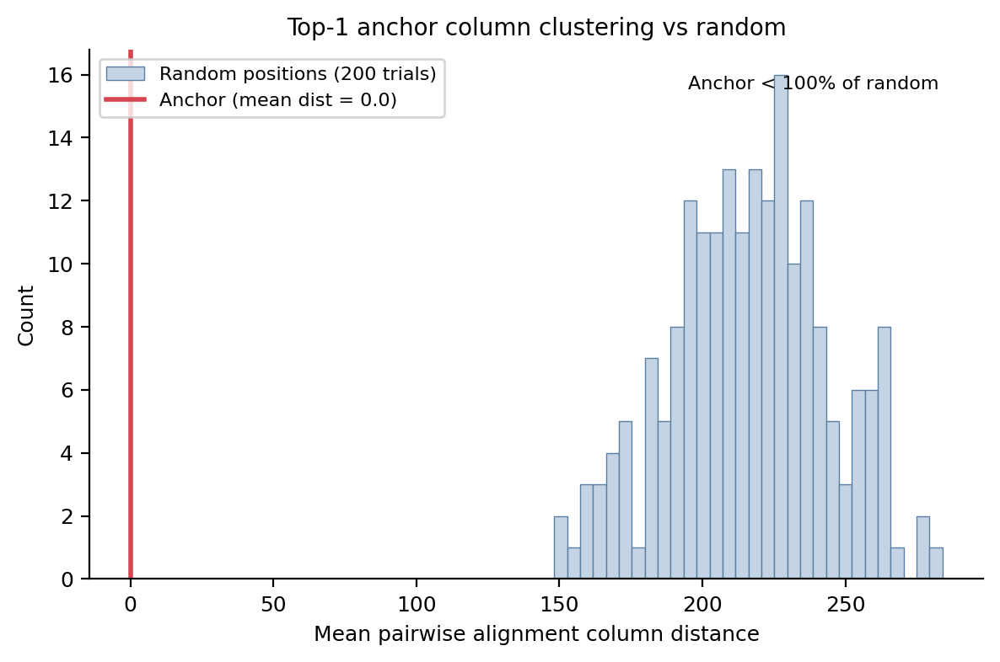
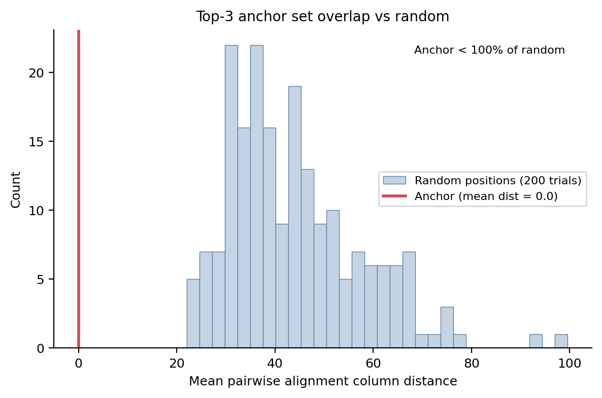
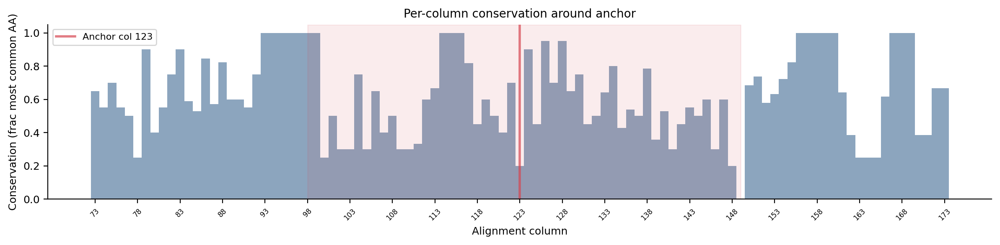
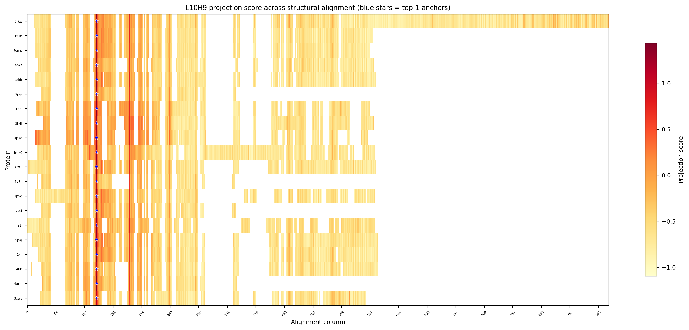
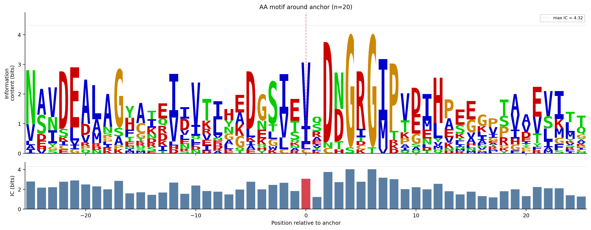
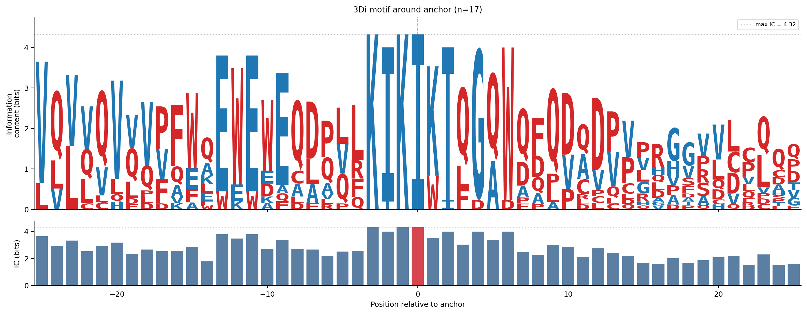

# Structure Anchor Transfer v2

## Data

Foldmason structural alignment of 98 entries (66 unique PDB IDs) from Foldseek top-2 hits for 1PVGA (TM > 0.6, seq id < 0.20).
After assembly collapse (98 -> 66) and deduplication at 90% identity (66 -> 20): 20 proteins.
Alignment length: 999 columns.

### Deduplication log

- Kept 6rkw, dropped ['6j90', '4kfg', '5mmn', '1aj6', '5mmo', '1kzn', '6kzv', '5z4h', '7dor', '6kzz', '7p2w', '6eng', '5z9q', '5z9l', '4zvi', '5l3j'] (>90% identity)
- Kept 1s16, dropped ['3fv5', '4hz0', '1s14'] (>90% identity)
- Kept 7cmp, dropped ['3lnu', '3lps'] (>90% identity)
- Kept 4hxz, dropped ['4hy1', '4hym', '4kqv'] (>90% identity)
- Kept 3zkb, dropped ['3zkd', '3zm7'] (>90% identity)
- Kept 7pqi, dropped ['7pql', '7pqm'] (>90% identity)
- Kept 1nhi, dropped ['1nhj', '1nhh', '1b62'] (>90% identity)
- Kept 6zt3, dropped ['6y8o', '4b6c', '6zt5', '4bae'] (>90% identity)
- Kept 6y8n, dropped ['6y8l'] (>90% identity)
- Kept 7ptf, dropped ['6m1j', '6m1s', '7ptg'] (>90% identity)
- Kept 1kij, dropped ['6enh'] (>90% identity)
- Kept 4urm, dropped ['4uro', '4p8o', '6tck', '6ttg', '3u2d', '5d6p'] (>90% identity)

## Phase 1: Anchor behavior audit

Reference search direction: d_ref from 1PVGA.
Sanity check: cos(d_ref_1pvg, d_ref_2b61) = 0.9482.
Anchor-like thresholds: top1_mass > 0.15, rank_corr > 0.3.

| PDB | N res | top1_mass | rank_corr | cos(d_self, d_ref) | Anchor pos | Anchor AA | Anchor-like |
|-----|-------|-----------|-----------|--------------------|-----------:|-----------|:-----------:|
| 6rkw | 781 | 0.349 | 0.969 | 0.994 | 69 | V | YES |
| 1s16 | 380 | 0.732 | 0.989 | 0.994 | 63 | V | YES |
| 7cmp | 374 | 0.745 | 0.991 | 0.993 | 63 | V | YES |
| 4hxz | 366 | 0.839 | 0.991 | 0.993 | 58 | V | YES |
| 3zkb | 387 | 0.652 | 0.989 | 0.994 | 66 | V | YES |
| 7pqi | 198 | 0.821 | 0.989 | 0.981 | 57 | V | YES |
| 1nhi | 333 | 0.587 | 0.988 | 0.967 | 57 | I | YES |
| 3h4l | 333 | 0.554 | 0.991 | 0.969 | 46 | C | YES |
| 4p7a | 303 | 0.347 | 0.986 | 0.966 | 58 | I | YES |
| 1mx0 | 456 | 0.642 | 0.990 | 0.988 | 70 | V | YES |
| 6zt3 | 394 | 0.648 | 0.989 | 0.993 | 77 | V | YES |
| 6y8n | 183 | 0.704 | 0.992 | 0.983 | 57 | V | YES |
| 1pvg | 378 | 0.756 | 0.988 | 0.999 | 90 | V | YES |
| 7ptf | 205 | 0.813 | 0.988 | 0.976 | 56 | V | YES |
| 4z1i | 365 | 0.795 | 0.982 | 0.977 | 86 | I | YES |
| 5j5q | 396 | 0.610 | 0.988 | 0.995 | 71 | V | YES |
| 1kij | 384 | 0.767 | 0.992 | 0.993 | 61 | V | YES |
| 4url | 364 | 0.659 | 0.987 | 0.992 | 56 | I | YES |
| 4urm | 195 | 0.844 | 0.992 | 0.981 | 54 | V | YES |
| 3cwv | 349 | 0.691 | 0.988 | 0.988 | 57 | L | YES |

20/20 proteins pass the anchor-like gate.

## Phase 2: Top-1 anchor column concordance

### Anchor positions in alignment coordinates

| PDB | Anchor seq pos | Anchor aln col |
|-----|---------------:|---------------:|
| 6rkw | 69 | 122 |
| 1s16 | 63 | 122 |
| 7cmp | 63 | 122 |
| 4hxz | 58 | 122 |
| 3zkb | 66 | 122 |
| 7pqi | 57 | 122 |
| 1nhi | 57 | 122 |
| 3h4l | 46 | 122 |
| 4p7a | 58 | 122 |
| 1mx0 | 70 | 122 |
| 6zt3 | 77 | 122 |
| 6y8n | 57 | 122 |
| 1pvg | 90 | 122 |
| 7ptf | 56 | 122 |
| 4z1i | 86 | 122 |
| 5j5q | 71 | 122 |
| 1kij | 61 | 122 |
| 4url | 56 | 122 |
| 4urm | 54 | 122 |
| 3cwv | 57 | 122 |

Mean pairwise distance: 0.0 columns.
Median: 0.0.
Exact match (dist=0): 190/190.
Within 5: 190/190.
Within 10: 190/190.

### Random position control

Anchor mean pairwise distance: 0.0.
Random mean (200 trials): 216.3 +/- 27.6.
Anchor tighter than 100% of random.

### Projection score transfer

380 non-gap transfers, 0 gaps.
Top-1: 100.0%, Top-3: 100.0%, Top-5: 100.0%, Top-10: 100.0%.
Mean projection rank: 0.0.

## Phase 3: Top-3 anchor column concordance

### Consensus anchor columns (tolerance=5)

| Column | N proteins | Fraction |
|-------:|-----------:|---------:|
| 123 | 20 | 100% |
| 179 | 19 | 95% |
| 536 | 8 | 40% |
| 106 | 1 | 5% |
| 364 | 1 | 5% |
| 703 | 1 | 5% |

Pairwise min set distance: mean=0.0, median=0.0.
Exact match: 190/190.
Within 5: 190/190.

## Phase 4: Local sequence conservation

Anchor column: 123.
Global mean conservation: 0.472.
Anchor window (+-25) mean conservation: 0.573.
Global mean pairwise seq identity: 0.298.
Local (+-25) mean pairwise seq identity: 0.327.
Paired t-test (local vs global identity): t=4.76, p=3.83e-06.
Local identity is significantly higher than global around the anchor.

## Phase 5: AA flank motif

n proteins: 20.
IC at anchor: 3.065 bits (max possible: 4.322).
Max IC: 4.036 bits at offset 4.
Anchor AA: {'V': 14, 'I': 4, 'C': 1, 'L': 1}.
Hydrophobic fraction: 95.0%.

## Phase 6: 3Di flank motif

n proteins: 17.
IC at anchor: 4.322 bits.
Max IC: 4.322 bits at offset -3.

### IC comparison (AA vs 3Di)

At anchor: AA=3.065, 3Di=4.322.
Max: AA=4.036, 3Di=4.322.
Mean: AA=2.212, 3Di=2.790.

## Interpretation

Top-1 concordance: POSITIVE. Anchor positions cluster in structural alignment space.
Local conservation: local sequence identity around anchor IS higher than global. Cannot fully separate structural signal from local sequence signal.
3Di vs AA: 3Di IC at anchor (4.322) > AA IC (3.065). Structural conservation exceeds sequence conservation at the anchor.

## Plots

